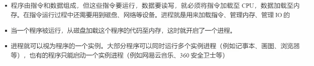

# JUC

## 进程与线程

### 概念

#### 进程与线程

**进程**

	

**线程**

	

**对比**

- 进程基本上相互独立，线程存在于进程之内，是进程的一个子集
- 进程拥有共享资源，如内存空间等，供其内部的线程共享
- 进程通信较为复杂
  - 同一台计算机的进程通信称为IPC（inter-process communication）
  - 不同计算机之间的进程通信需要通过网络，并遵循共同的协议，如HTTP
- 线程通信相对简单，他们共享进程内的内存，多个线程可以访问同一个共享变量
- 线程更轻量，线程上下文切换成本一般上比进程上下文切换成本低。

#### 并行与并发

**并发**

单核 cpu 下，线程实际还是**串行执行** 的。操作系统中有一个组件叫任务调度器，将 cpu 的时间片（windows 下时间片最小约为 15 ms） 分给不同的线程使用，一般会将 **线程轮流使用 CPU ** 的做法叫 ***并发***  

 

 

**并行**

多核 cpu 下， 每个核都可以调度运行线程， 这时候线程可以是 ***并行***

 

 

#### 应用

 

 

 

## Java线程

### 创建与运行线程

#### 方法一：直接使用 Thread

 

#### 方法二：使用 Runnable 配合 Thread

把【线程】和【任务】代码分开

- Thread 代表线程
- Runnable 可运行的任务

 

#### Thread 与 Runnable 的关系

- 方法1 是把线程和任务合并在一起了，方法2 是把线程和任务分开了
- 用 Runnable 更容易与线程池等高级 API 配合
- 用 Runnable 让任务脱离了 Thread 继承体系，更灵活

#### 方法三：FutureTask 配合 Thread

FutureTask 能接收 Callable 类型的参数，用来处理有返回结果的情况

 

### 查看进程线程的方法

**Windows**

- 任务管理器
- tasklist 查看进程
- taskkill 杀死进程

**Linux**

- ***ps -fe***  查看所有进程
- ***ps -fT -p <PID>***  查看某个进程的所有线程
- kill 杀死进程
- top 按大写 H 切换是否显示线程
- ***top -H -p <PID>*** 查看某个进程的所有线程

**Java**

- ***jps*** 查看所有Java进程
- ***jstack <PID>*** 查看某个Java进程的所有线程状态
- ***jconsole*** 查看某个Java进程中线程的运行情况

 

### *原理——线程运行

#### 栈与栈帧

每个线程的启动后，虚拟机都会为其分配一块栈内存

- 每个栈由多个栈帧（Frame）组成， 对应着每次方法调用时所占用的内存
- 每个线程只能有一个活动栈帧，对应着当前正在执行的那个方法

**图解** 

 

 

 

 

 

 

 

 

 

#### 线程上下文切换（Thread Context Switch）

**导致cpu不在执行当前线程原因**

1. 线程的cpu 时间片用完
2. 垃圾回收
3. 有更高优先级的线程需要运行
4. 线程自己调用了sleep、yield、wait、join、park、synchronized、lock等方法

当Context Switch 发生时，需要由操作系统保存当前线程的状态，并恢复另一个线程的状态，Java中对应的概念就是程序计数器。