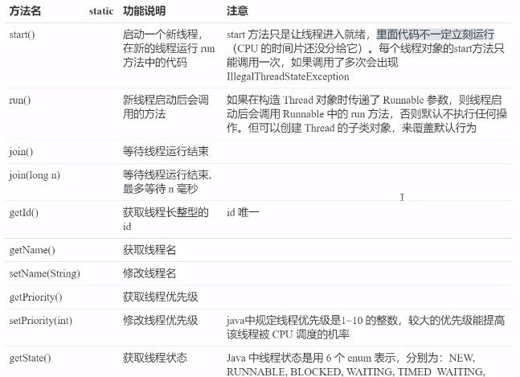
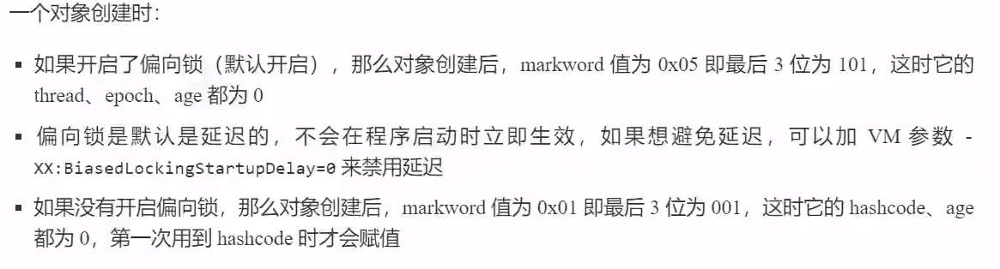
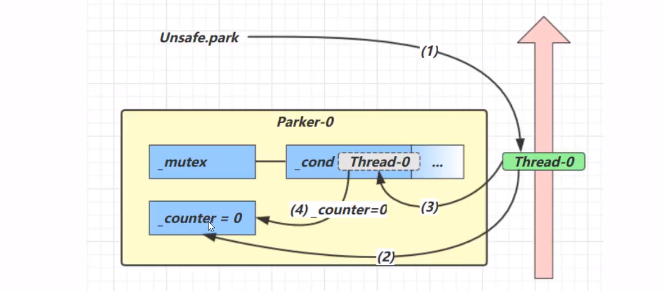
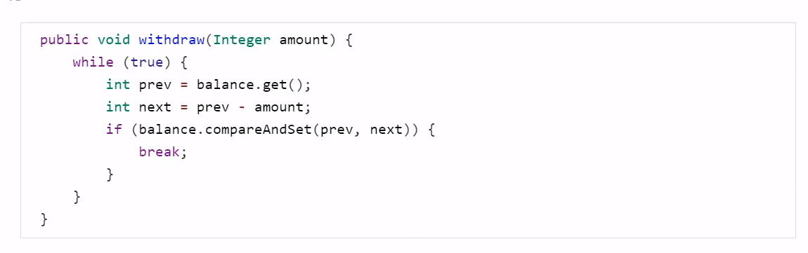
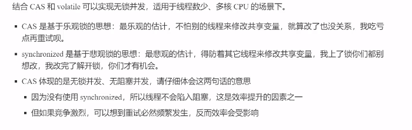
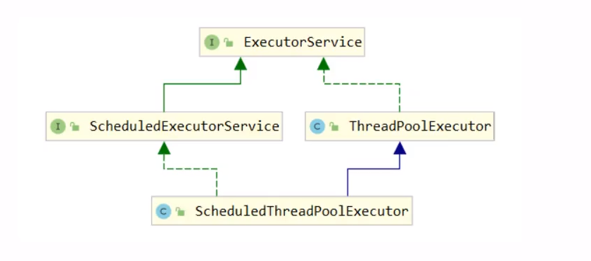
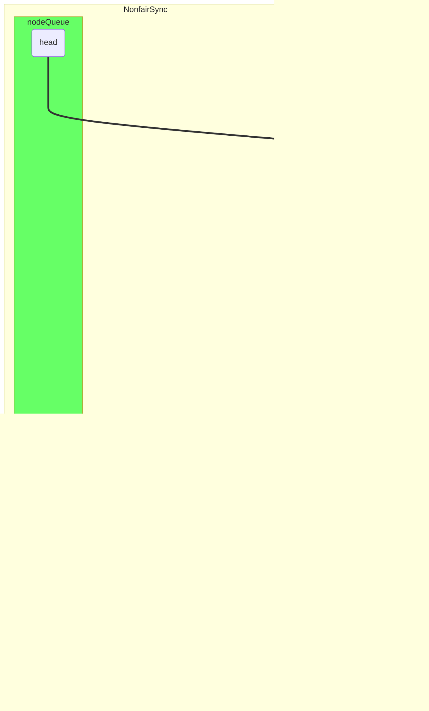
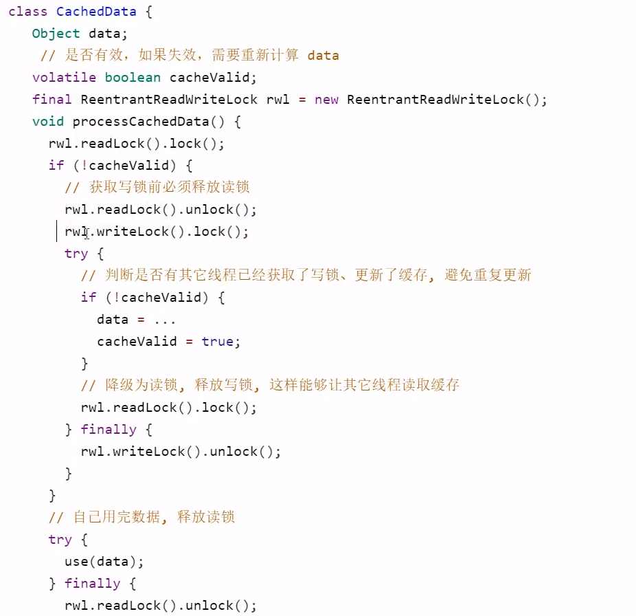
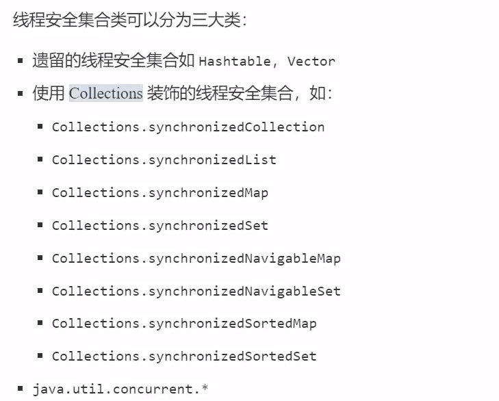

# JUC

## 进程与线程

### 概念

#### 进程与线程

**进程**

	

**线程**

	

**对比**

- 进程基本上相互独立，线程存在于进程之内，是进程的一个子集
- 进程拥有共享资源，如内存空间等，供其内部的线程共享
- 进程通信较为复杂
  - 同一台计算机的进程通信称为IPC（inter-process communication）
  - 不同计算机之间的进程通信需要通过网络，并遵循共同的协议，如HTTP
- 线程通信相对简单，他们共享进程内的内存，多个线程可以访问同一个共享变量
- 线程更轻量，线程上下文切换成本一般上比进程上下文切换成本低。

#### 并行与并发

**并发**

单核 cpu 下，线程实际还是**串行执行** 的。操作系统中有一个组件叫任务调度器，将 cpu 的时间片（windows 下时间片最小约为 15 ms） 分给不同的线程使用，一般会将 **线程轮流使用 CPU ** 的做法叫 ***并发***  

 

 

**并行**

多核 cpu 下， 每个核都可以调度运行线程， 这时候线程可以是 ***并行***

 

 

#### 应用

 

 

 

## Java线程

### 创建与运行线程

#### 方法一：直接使用 Thread

 

#### 方法二：使用 Runnable 配合 Thread

把【线程】和【任务】代码分开

- Thread 代表线程
- Runnable 可运行的任务

 

#### Thread 与 Runnable 的关系

- 方法1 是把线程和任务合并在一起了，方法2 是把线程和任务分开了
- 用 Runnable 更容易与线程池等高级 API 配合
- 用 Runnable 让任务脱离了 Thread 继承体系，更灵活

#### 方法三：FutureTask 配合 Thread

FutureTask 能接收 Callable 类型的参数，用来处理有返回结果的情况

 

### 查看进程线程的方法

#### Windows

- 任务管理器
- tasklist 查看进程
- taskkill 杀死进程

#### Linux

- ***ps -fe***  查看所有进程
- ***ps -fT -p <PID>***  查看某个进程的所有线程
- kill 杀死进程
- top 按大写 H 切换是否显示线程
- ***top -H -p <PID>*** 查看某个进程的所有线程

#### Java

- ***jps*** 查看所有Java进程
- ***jstack <PID>*** 查看某个Java进程的所有线程状态
- ***jconsole*** 查看某个Java进程中线程的运行情况

 

### *<font color="#FF5151">原理——线程运行</font>

#### 栈与栈帧

每个线程的启动后，虚拟机都会为其分配一块栈内存

- 每个栈由多个栈帧（Frame）组成， 对应着每次方法调用时所占用的内存
- 每个线程只能有一个活动栈帧，对应着当前正在执行的那个方法

**图解** 

 

 

 

 

 

 

 

 

 

#### 线程上下文切换（Thread Context Switch)

**导致cpu不在执行当前线程原因**

1. 线程的cpu 时间片用完
2. 垃圾回收
3. 有更高优先级的线程需要运行
4. 线程自己调用了sleep、yield、wait、join、park、synchronized、lock等方法

当Context Switch 发生时，需要由操作系统保存当前线程的状态，并恢复另一个线程的状态，Java中对应的概念就是程序计数器。

1. 状态包括程序计数器、虚拟机栈中每个栈帧的信息、如局部变量表、操作数栈、返回地址等
2. Context Switch 频繁会影响性能

**图解**

主线程时间片耗尽

 

切换线程，保存状态

 

t1线程时间片耗尽，切换回main线程

 

### 常见方法

 

 

#### start 与 run 

 

#### sleep 与 yield

##### sleep

1. 调用sleep会让当前线程从 Running 进入 Time Waiting 状态

    

    

2. 其他线程可以使用 interrupt 方法打断正在睡眠的线程，这时 sleep 方法会抛出 InterruptedException

    

    

3. 睡眠结束后的线程未必会立刻得到执行

4. 建议用 TimeUnit 的 sleep 代替 Thread 的 sleep 来获取更好的可读性

    

   **TimeUnit sleep 内部实现** 

    

##### yield

1. 调用 yield 会让当前线程从 Running 进入 Runnable 状态，然后调度执行其他同优先级的线程，如果这时没有同优先级的线程，那么不能保证让当前线程暂停的效果
2. 具体的实现依赖于操作系统的任务调度器

##### 线程优先级

1. 线程优先级会提示（hint）调度器优先调度该线程，但它仅仅说提示，调度器可以忽略它
2. 如果 cpu 繁忙，那么优先级高的线程会获得更多的时间片，如果 cpu 空闲，优先级几乎没有作用

 

 

##### <font color=" #28FF28">*案例-防止CPU占用100%</font> 

 

#### join

 

 

 

##### <font color=" #28FF28">*案例-应用同步</font> 

 

##### 有时效的join

当时效小于实际线程结束时间时，join按照输入时间提前结束

但时效大于实际线程结束时间时，join按照实际线程结束实际结束

#### interrupt

##### 打断sleep、wait、join线程

 

 

打断标记可以被用来使线程停止

##### *<font color=" FF9D6F">设计模式-两阶段终止</font> 

**Two Phase Termination** 

在一个线程 T1 中通知 T2 终止， T2 处理完自行终止

**错误思路** 

 

**实现思路**

 

 

##### 打断patk线程

 

如果打断标记为true，则park会失效，此时应该配合Interrupted方法使用而不是isInterrupted

- 使用isInterrupted  

   

- 使用interrupted

   

   

### 不推荐使用方法

 

### 主线程与守护线程

默认情况下，Java 进程需要等待所有线程都运行结束，才会结束。但有一种特殊的线程叫 **守护线程** 只要其他非守护线程运行结束，即使守护线程的代码没有执行完，守护线程也会强制结束。

 

**守护线程常见应用**

- 垃圾回收器线程
- Tomcat 中的 Acceptor 和 Pooler 线程都是守护线程

### 线程状态

#### 五种状态

从 **操作系统** 层面描述

 

 

#### 六种状态

从 **Java API** 层面描述

根据 Thread State 枚举，分为六种状态

 

 

### 本章小结

 

## 共享模型之管程

### 共享带来的问题

#### 小故事

 

 

 

#### Java 的体现

 

#### 问题分析

 

 

 

 

 

 

#### 临界区 Critical Section

- 一个程序运行多个线程本身没有问题
- 问题出在多个线程访问共享资源
  - 多个线程读共享资源也没有问题
  - 在多个线程对共享资源读写操作时发生指令交错，就会出现问题
- 一段代码块内如果存在对共享资源的多线程读写操作，称这段代码块为 **临界区** 

 

#### 竟态条件 Race Condition

多个线程在临界区内执行，由于代码的执行序列不同而导致结果无法预测，称之为发生了 **竟态条件** 

### synchronized 解决方案

#### <font color=" #28FF28">*案例-应用互斥</font> 

 

#### synchronized语法

 

 

**图解**

 

synchronized 实际说用 **对象锁** 保证了 **临界区内代码的原子性** ，临界区内的代码对外是不可分割的，不会被线程切换所打断

### 方法上的synchronized

#### 成员方法

 

#### 静态方法

 

#### 线程八锁

考察synchronized锁住的是哪个对象

- **情况一 : 锁住this** 

  **现象** ： 直接打印1 2 或 直接打印 2 1

   

- **情况二 : 锁住this** 

  **现象** ： 一秒后打印1再打印2 或 先打印2一秒后打印1

   

- **情况三 ： 锁住a,b 的this对象**

  **现象**：3 一秒后1 2 或 3 2 一秒后 1 或 2 3 一秒后 1

   

- **情况四 ：锁住不同对象的this**

  **现象** ： 先打印2一秒后打印1

   

- **情况五 ：a锁住class对象， b锁住this**

  **现象** ： 先打印2一秒后打印1

   

- **情况六 ：锁住class对象**

  **现象** ：一秒后打印1再打印2 或 先打印2一秒后打印1

   

- **情况七 ：a锁住n1的class , b 锁住n2的this**

  **现象**：先打印2一秒后打印1

   

- **情况八 ：锁住class对象**

  **现象** ：一秒后打印1再打印2 或 先打印2一秒后打印1

   

### 变量的线程安全分析

#### 成员变量与静态变量是否线程安全？

- 如果他们没有共享，则线程安全
- 如果他们被共享了，根据他们的状态是否能够改变又分为两种情况
  - 如果只有读操作，则线程安全
  - 如果有读写操作，则这段代码是临界区，需要考虑线程安全

#### 局部变量是否线程安全？

- 局部变量是线程安全的
- 局部变量的引用对象则未必
  - 如果该对象没有逃离方法的作用访问，则线程安全
  - 如果该对象逃离方法的作用范围，需要考虑线程安全

#### 局部变量线程安全分析

- **局部变量** 

   

   

- 成员变量

   

   

   

- 局部变量引用

  当访问修饰符为 *private* 

   

   

  当访问修饰符为 *public*

   

  **情况一不会产生线程安全问题，但情况二不同，会导致list变为共享资源，从而产生线程安全问题**

#### 常见线程安全类

 

##### 线程安全类的组合-- 可能线程不安全

 

##### 不可变类线程的安全性 -- 线程安全

 

### Monitor 概念

#### Java 对象头

  

#### Monitor（监视器/管程）

  

##### *<font color="#FF5151">原理——synchronized</font>

 

 

##### *<font color="#FF5151">原理——synchronized进阶</font>

###### 轻量级锁

**使用场景** 如果一个对象虽然有多线程访问，但多线程访问的时候是错开的（没有竞争对象），可以使用轻量级锁

 

       

###### 锁膨胀

如果在尝试加轻量级锁的过程中，CAS操作无法成功，这时一种情况就是有其他线程为此对象加上了轻量级锁（有竞争），这时需要进行锁膨胀，将轻量级锁变为重量级锁

   

###### 自旋优化

重量级锁竞争的时候还可以使用自旋来进行优化，如果当前线程自旋成功（这时候持锁进程已经退出了同步块，释放了锁），这时当前线程就可以避免阻塞

 

 

 

###### 偏向锁

轻量级锁在没有竞争时（就自己这个线程），每次重入仍然需要执行CAS操作

Java6中引入偏向锁来做进一步优化，只有第一次使用CAS将线程ID设置到对象的Mark Word 头，之后发现这个线程ID是自己的就表示没有竞争，不用重新CAS. 以后只要不发生竞争，这个对象就归该线程所有

 

 

 

 

 

   

 

 

 

###### 锁消除

 

JIT 进行锁消除优化

 

去除锁消除优化

 

### wait notify

#### 小故事

  

#### *<font color="#FF5151">原理——wait / notify</font>

 

#### API

 

#### sleep（long n）和 wait (long n)的区别

- sleep 是 Thread 方法，而 wait 是 Object 的方法
- sleep 不需要强制和 synchronized 配合使用，但 wait 需要和 synchronized 一起使用
- sleep 在睡眠的同时，不会释放对象锁，但 wait 在等待的时候会释放对象锁
- 状态都是 TIME_WAITING

#### 使用方式

 

#### *<font color=" FF9D6F">设计模式-保护性暂停</font> 

**Guarded Suspension** 

用在一个线程等待另一个线程的执行结果

**实现要点**

 

 

**超时等待** 

 

#### *<font color="#FF5151">原理——join</font>

 

#### *<font color=" FF9D6F">设计模式-生产者/消费者</font> 

该模式为异步模式，保护性暂停为同步模式

**实现要点** 

 

### park & Unpark

#### 基本使用

 

  

#### 特点

 

#### *<font color="#FF5151">原理——park & unpark</font>

      

### 重理解线程状态转换

 

 

 

 

 

 

 

 

 

 

 

### 多把锁

#### 多把不相干的锁

 

 

**结论**

将锁的粒度细分（业务不相干才能细分）

- 好处，可以增强并发度
- 坏处，如果一个线程需要同时获得多把锁，容易发生死锁

### 活跃性

#### 死锁

 

#### 解决方案

**死锁图解**

 

**顺序加锁 --- 产生饥饿** 

 

#### 哲学家就餐问题

 

#### 活锁

两个线程互相改变对方的结束条件，最后谁也无法结束

 

#### 饥饿

一个线程由于优先级太低，始终得不到CPU 调度执行，从而不能结束

### ReentrantLock

相对于synchronized 它具有如下特点

- 可中断
- 可设置超时时间
- 可设置为公平锁
- 支持多个条件变量

与 synchronized 一样，都支持可重入

**基本语法**

 

#### 可重入

同一个线程如果首次获得了这把锁，那么因为它是这把锁的拥有者，因此有权利再次获取这把锁，如果是不可重入锁，那么第二次获得锁时，自己也会被锁挡住

#### 可打断

#### 锁超时

 

#### 公平锁

ReentrantLock 默认不公平

 

公平锁一般没有必要，会降低并发度

#### 条件变量

 

#### *<font color=" FF9D6F">设计模式-顺序控制</font> 

##### 固定运行顺序

先t2 后 t1

**wait - notify** 

 

**park & unpark**

 

**await - signal**


**交替输出**

线程1 输出  a 5 次，线程 2 输出 b 5 次 ，线程 3 输出 c 5次，现在要求按照 abcabcabc。。。 的顺序输出

**wait notify**

 

**await - signal**

 

**park & unpark** 

 

### 本章小结

  

## 共享模型之内存

### Java内存模型（JMM）

从Java层面定义了主存，工作内存抽象概念，底层对应着CPU寄存器、缓存、硬件内存、CPU指令优化等

**JMM 体现在以下几个方面**

- 原子性：保证指令不会受到线程上下文切换的影响
- 可见性：保证指令不会受 CPU 缓存的影响
- 有序性：保证指令不会受 CPU 指令并行优化的影响

### 可见性

#### 退不出的循环

main 线程对 run 变量的修改对于 t  线程不可见，导致了 t 线程无法停止

 

**分析**

   

#### 解决方法

volatile（易变关键字）

它可以用来修饰成员变量和静态成员变量，他可以避免线程从自己的工作缓存中查找变量的值，必须到主存中获取它的值，线程操作 volatile 变量直接操作主存

#### 可见性 vs 原子性

  

**注意**

synchronized 语句块既可以保证代码块的原子性，也同时保证代码块内变量的可见性，但synchronized属于重量级操作，性能相对更低

#### *<font color=" FF9D6F">设计模式-Balking</font> 


用来实现线程安全的单例

 

### 有序性

JVM在不影响正确性的前提下，会调整语句的执行顺序

 

#### *<font color="#FF5151">原理——指令级并行</font>

 

 

### *<font color="#FF5151">原理——volatile</font>

volatile 底层实现原理是内存屏障，Memory Barrier （Memory Fence）

- 对volatile变量的写指令后会加入写屏障
- 对volatile变量的读指令前会加入读屏障

#### 保证可见性

   

#### 保证有序性

   

#### double-checked locking 问题

 

**改进**

 

发生指令重排

 

第0行 getstatic 在 monitor 控制之外，当 t1 线程还未完全将构造方法执行完毕，t2 线程将拿到的是一个未完成初始化的单例 

#### double-checked locking 解决方案

增加volatile关键字阻止重排序 

 

#### happens-before

happens-before 规定了对共享变量的写操作对其他线程的读操作可见，是可见性与有序性的一套规则的总结

- 线程解锁 m 之前对变量的写，对于接下来对 m  加锁的其他线程对改变量的读可见

   

- 线程对 volatile 变量的写，对接下来其他线程对该变量的读可见

   

- 线程 start 前对变量的写，对该线程开始后对该变量的读可见

   

- 线程结束前对变量的写，对其他线程得知它结束后的读可见

   

- 线程 t1 打断 t2 （interrupt）前对变量的写，对于其他线程得知 t2 被打断后对变量的读可见

   

- 对变量默认值（0，false，null）的写，对其他线程对该变量的读可见

- 具有传递性，如果 x hb-> y 且 y hb-> z 则 x hb-> z ，配合volatile的防指令重排

#### 线程单例安全实现

     

### 本章小结

 

## 共享模型之无锁

### CAS 与 volatile

#### 无锁实现共享变量的保护 compareAndSet (CAS)

 

**实现时序图** 

 

#### volatile

 

#### 为什么无锁效率高

 

#### CAS特点

 

### 原子类

#### 原子整数

- AtomicBoolean
- AtomicInteger
- AtomicLong

**常见API**

 

 

```java
// 获取并更新，传递参数为lambda函数，可做更多运算
i.getAndUpdate(value -> value * 10); 

// 更新并获取，传递参数为lambda函数，可做更多运算
i.updateAndGet(value -> value / 10);

// 底层实现方法 通过cas实现
public final int updateAndGet(IntUnaryOperator updateFunction){
    int perv, next;
    do{
        perv = get();
        next = updateFunction.applyAsInt(perv);
    }while(!compareAndSet(prev, next));
    return next;
}
```

#### 原子引用

- AtomicReference
- AtomicMarkableReference
- AtomicStampedReference

**AtomicReference**

****

```java
class DecimalAccountCas impletemts DecimalAccount{
    private AtomicReference<BigDecimal> balance;
    
    public DecimalAccountCas(BigDecimal balance){
        this.balance = new AtomicReference<>(balance);
    }
    
    @Override
    public BigDecimal getBalance() {
        return balance.get();
    }
    
    @Override
    public void withdraw(BigDecimal amount){
        while(true){
            BigDecimal prev = balance.get();
            BigDecimal next = prev.subtract(amount); // 减去值
            if(balance.compareAndSET(prev, next))
                break;
        }
    }
}

interface DecimalAccount {
    // 获取余额
    BigDecimal getBalance();
    
    // 取款
    void withdraw(BigDecimal amount);
	
    /**
	方法内启动1000个线程，每个线程做-10的操作
    如果初始余额为10000 那么正确的结果应当是 0
     */
    static void demo(DecimalAccount account){
        List<Thread> ts = new ArrayList<>();
        for(int i = 0; i < 1000; i++){
            ts.add(new Thread(() -> {
                account.withdraw(BigDecimal.TEN);
            }));
        }
        ts.forEach(Thread::start);
        ts.forEach(t -> {
            try{
                t.join();
            } catch (InterruptException e){
                e.printStackTrace();
            }
        });
        System.out.println(account.getBalance());
    }
}
```

##### ABA问题

主线程仅能判断出共享变量的值与最初值 A 是否相同，不能感知到是否有线程将值从A -> B 又从B -> A

```java
static AtomicReference<String> ref = new AtomicReference<> ("A");
public static void main(String[] args) throws InterruptedException{
    String prev = ref.get();
    other();
    sleep(1);
    ref.compareAndSet(prev, "C");
}

private static void other(){
    new Thread(() -> {
        ref.compareAndSet(ref.get(), "B");
    }, "t1").start();
    new Thread(() -> {
         ref.compareAndSet(ref.get(), "A");
    }, "t2").start();
}
```

为了解决这种问题，只需要在其中加一个版本号，可以追踪原子引用整个变化的过程

**AtomicStampedReference**

```java
static AtomicStampedReference<String> ref = new AtomicStampedReference<> ("A", 0);
public static void main(String[] args) throws InterruptedException{
    String prev = ref.getReference(); // 获取值
    int stamp = ref.getStamp(); // 获取版本号
    other();
    sleep(1);
    ref.compareAndSet(prev, "C", stamp, stamp + 1);
}

private static void other(){
    new Thread(() -> {
        int stamp = ref.getStamp(); 
        ref.compareAndSet(ref.getReference(), "B", stamp, stamp + 1);
    }, "t1").start();
    new Thread(() -> {
        int stamp = ref.getStamp(); 
         ref.compareAndSet(ref.getReference(), "A", stamp, stamp + 1);
    }, "t2").start();
}
```

如果并不关心修改多少次，只是单纯关系是否更改过，这时可以使用**AtomicMarkableReference** 它将版本号换为了布尔值

#### 原子数组

- AtomicIntegerArray
- AtomicLongArray
- AtomicReferenceArray

```java
public static void main(String[] args){
    // 线程不安全
    demo(
    	() -> new int[10],
        (array) -> array.length,
        (array, index) -> array[index]++,
        array -> System.out.println(Array.toString(array))
    );
    
    // 线程安全
    demo(
    	() -> new AtomicIntegerArray(10),
        (array) -> array.length,
        (array, index) -> array.getAndIncrement(index),
        array -> System.out.println(array)
    );
}

/*
方法内启动10个线程，并发让数组所有元素总共自增 10000 次
	参数1， 提供数组、可以是线程安全的也可以是不安全的数组
	参数2， 获取数组长度
	参数3， 自增方法，回传array， index
	参数4， 打印数组方法
*/
/*
	supplier 提供者 无中生有 （） -> 结果
	function 函数 一个参数一个结果 （参数）-> 结果	BiFunction(参数1， 参数2) -> 结果
	consumer 消费者 一个参数没结果 (参数) -> void	BiConsumer(参数1，参数2) -> void
*/
private static <T> demo(
    Supplier<T> arraySupplier,
    Function<T, Integer> lengthFun,
    BiConusumer<T, Integer> putConsumer,
    Consumer<T> printConsumer){
    List<Thread> ts = new ArrayList<>();
    T array = arraySupplier.get();
    int length = lengthFun.apply(array);
    for(int i = 0; i < length; i++){
        ts.add(new Thread(() -> {
            for(int j = 0; j < 10000; j++){
            	putConsumer.accept(array, j%length);    
            }
        }));
    }
    ts.forEach(t -> t.start());
    ts.forEach(t -> {
        try{
            t.join();
        } catch (InterruptException e){
            e.printStackTrace();
        }
    });
}
```

#### 字段更新器

- AtomicIntegerFieldUpdater
- AtomicLongFieldUpdater
- AtomicReferenceFieldUpdater

利用字段更新器可以针对对象的某个域（Field）进行原子操作，只能配合volatile修饰的字段使用，否则会出现异常

```java
Exception in thread "main" java.lang.IllegalArgumentException: Must be volatile type
```

```java
public static void main(String[] args){
    Student stu = new Student();
    AtomicReferenceFieldUpdater updater = 
    			AtomicReferenceFieldUpdater.newUpdater(Student.class, String.class, "name");
    System.out.println(updater.compareAndSet(stu, null, "张三"));
    System.out.println(stu);
}

@Data
class Student{
    String name;
}
```

#### 原子累加器

##### 累加器性能比较

```java
public static void main(String[] args){
    for(int i = 0; i < 5; i++){
        demo{
            () -> new AtomicLong(0),
            (adder) -> adder.getAndIncrement()
        };
    }
    for(int i = 0; i < 5; i++){
        demo{
            () -> new LongAdder(),
            (adder) -> adder.increment()
        };
    }
}

private static <T> void demo(Supplier<T> adderSupplier, Consumer<T> action){
    T adder = adderSupplier.get();
    long start = System.nanoTime();
    List<Thread> ts = new ArrayList<>();
    for(int i = 0; i < 40; i++){
        ts.add(new Thread(() -> {
            for(int j = 0; j < 500000; j++){
                action.accept(adder);
            }
        }));
    }
    ts.froEach(t -> t.start());
    ts.forEach(t -> {
        try{
            t.join();
        } catch (InterruptException e){
            e.printStackTrace();
        }
    });
    long end = System.nanoTime();
    System.out.println(adder + " cosst:" + (end - start)/1000_000);
}
```

 

 

##### 源码—— LongAdder

LongAdder 关键域

```java
// 累加单元数组， 懒惰初始化
transient volatile Cell[] cells;

// 基础值，如果没有竞争，则用cas累加这个域
transient volatile long base;

// 在cells创建或扩容时， 置为 1 ， 表示加锁
transient volatile int cellsBusy;
```

**cas 实现锁**

```java
public class LockCas{
 	private AtomicInteger state = new AtomicInteger(0);
    
    public void lock(){
        while(true){
            if(state.compareAndSet(0, 1))
                break;
        }
    }
    
    public void unlock(){
        System.out.println("unlock....");
        state.set(0);
    }
    
    public static void main(String[] args){
        LockCas lock = new LockCas();
        new Thread(() -> {
            System.out.println("begin....");
            lock.lock();
            try{
                System.out.println("lock....");
                sleep(1);
            }finally{
                lock.unlock();
            }
        }, "t1").start();
        
        new Thread(() -> {
            System.out.println("begin....");
            lock.lock();
            try{
                System.out.println("lock....");
            }finally{
                lock.unlock();
            }
        }, "t2").start();
    }
}
```

**cell实现**

```java
// 防止缓存行伪共享
@sun.misc.Contended
static final class Cell{
    volatile long value;
    Cell(long x){ value = x };
    // 通过cas方式进行累加,prev表示旧值， next表示新值
    final boolean cas(long prev, long next){
        return UNSAFE.compareAndSwapLong(this, valueOffset, perv, next);
    }
}
```

     

**add() **

```java
public void add(long x){
    Cell[] as;
    long b, v;
    int m;
    Cell a;
    if((as = cells) != null || !casBase(b = base, b + x)){
        boolean uncontended = true;
        if(as == null || (m = as.length - 1) < 0 ||
          (a = as[getProbe() & m]) == null ||
           !(uncontended = a.cas(v= a.value, v + x))){
            	longAccumulate(x, null, uncontended);
        }
    }
}
```

 

**longAccumulate() **

```java
final void longAccumulate(long x, LongBinaryOperator fn,
                              boolean wasUncontended) {
    int h;
    if ((h = getProbe()) == 0) {
        ThreadLocalRandom.current(); // force initialization
        h = getProbe();
        wasUncontended = true;
    }
    boolean collide = false;                // True if last slot nonempty
    done: for (;;) {
        Cell[] cs; Cell c; int n; long v;
        if ((cs = cells) != null && (n = cs.length) > 0) {
            if ((c = cs[(n - 1) & h]) == null) {
                if (cellsBusy == 0) {       // Try to attach new Cell
                    Cell r = new Cell(x);   // Optimistically create
                    if (cellsBusy == 0 && casCellsBusy()) {
                        try {               // Recheck under lock
                            Cell[] rs; int m, j;
                            if ((rs = cells) != null &&
                                (m = rs.length) > 0 &&
                                rs[j = (m - 1) & h] == null) {
                                rs[j] = r;
                                break done;
                            }
                        } finally {
                            cellsBusy = 0;
                        }
                        continue;           // Slot is now non-empty
                    }
                }
                collide = false;
            }
            else if (!wasUncontended)       // CAS already known to fail
                wasUncontended = true;      // Continue after rehash
            else if (c.cas(v = c.value,
                           (fn == null) ? v + x : fn.applyAsLong(v, x)))
                break;
            else if (n >= NCPU || cells != cs)
                collide = false;            // At max size or stale
            else if (!collide)
                collide = true;
            else if (cellsBusy == 0 && casCellsBusy()) {
                try {
                    if (cells == cs)        // Expand table unless stale
                        cells = Arrays.copyOf(cs, n << 1);
                } finally {
                    cellsBusy = 0;
                }
                collide = false;
                continue;                   // Retry with expanded table
            }
            h = advanceProbe(h);
        }
        else if (cellsBusy == 0 && cells == cs && casCellsBusy()) {
            try {                           // Initialize table
                if (cells == cs) {
                    Cell[] rs = new Cell[2];
                    rs[h & 1] = new Cell(x);
                    cells = rs;
                    break done;
                }
            } finally {
                cellsBusy = 0;
            }
        }
        // Fall back on using base
        else if (casBase(v = base,
                         (fn == null) ? v + x : fn.applyAsLong(v, x)))
            break done;
    }
}
```

 

 

 

**sum() **

```java
public long sum() {
    Cell[] as = cells; Cell a;
    long sum = base;
    if (as != null) {
        for (int i = 0; i < as.length; ++i) {
            if ((a = as[i]) != null)
                sum += a.value;
        }
    }
    return sum;
}
```

### unsafe

unsafe对象提供了非常底层的操作内存、线程的方法，unsafe对象不能直接调用

 

#### unsafe cas操作

 

### 本章小结

 

## 共享模型之不可变

### 日期转换问题

 

出现java.lang,NumberFormatException或者出现不正确的日期解析结果

可以通过使用不可变对象解决这个问题

```java
public static void main(String[] args){
    DateTimeFormatter stf = DateTimeFormatter.ofPattern("yyyy-mm-dd");
    for(int i = 0; i < 10; i++){
        new Thread(() -> {
            TemporalAccessor parse = stf.parse("1951-04-21");
        }).start();
    }
}
```

### 不可变类的设计

设计要素

**使用final**

1. 属性用final修饰保证了该属性只读，不能修改、
2. 类用final修饰保证了该类中的方法不能被覆盖，防止子类无意间破坏不可变性

**保护性拷贝**

String 不可变，当新赋值时

```java
public String (@NotNull char value[]){
    this.value = Arrays.copyOf(value, value.length);
}
```

获取其子串

```java
public String substring(int beginIndex, int endIndex) {
    if (beginIndex < 0) {
        throw new StringIndexOutOfBoundsException(beginIndex);
    }
    if (endIndex > value.length) {
        throw new StringIndexOutOfBoundsException(endIndex);
    }
    int subLen = endIndex - beginIndex;
    if (subLen < 0) {
        throw new StringIndexOutOfBoundsException(subLen);
    }
    return ((beginIndex == 0) && (endIndex == value.length)) ? this
        : new String(value, beginIndex, subLen);
}

public String(char value[], int offset, int count) {
    if (offset < 0) {
        throw new StringIndexOutOfBoundsException(offset);
    }
    if (count <= 0) {
        if (count < 0) {
            throw new StringIndexOutOfBoundsException(count);
        }
        if (offset <= value.length) {
            this.value = "".value;
            return;
        }
    }
    // Note: offset or count might be near -1>>>1.
    if (offset > value.length - count) {
        throw new StringIndexOutOfBoundsException(offset + count);
    }
    this.value = Arrays.copyOfRange(value, offset, offset+count);
}
```

这种通过创建副本来避免共享的手段称之为【保护性拷贝】

#### *<font color=" FF9D6F">设计模式-享元模式</font> 

##### 定义

Flyweight pattern 当需要重用数量有限的同一类对象时 属于Structual patterns

##### 体现

###### 包装类

**valueOf()**

Byte、Short、Long 

```java
// byte
public static Byte valueOf(byte b) {
    final int offset = 128;
    return ByteCache.cache[(int)b + offset];
}

// short
public static Short valueOf(short s) {
    final int offset = 128;
    int sAsInt = s;
    if (sAsInt >= -128 && sAsInt <= 127) { // must cache
        return ShortCache.cache[sAsInt + offset];
    }
    return new Short(s);
}

// long
public static Long valueOf(long l) {
    final int offset = 128;
    if (l >= -128 && l <= 127) { // will cache
        return LongCache.cache[(int)l + offset];
    }
    return new Long(l);
}
```

Character 

```java
public static Character valueOf(char c) {
    if (c <= 127) { // must cache
        return CharacterCache.cache[(int)c];
    }
    return new Character(c);
}
```

Integer

```java
public static Integer valueOf(int i) {
    if (i >= IntegerCache.low && i <= IntegerCache.high)
        return IntegerCache.cache[i + (-IntegerCache.low)];
    return new Integer(i);
}
```

Boolean 

```java
public static Boolean valueOf(boolean b) {
    return (b ? TRUE : FALSE);
}
```


**缓存大小**

Byte、Short、Long 

```java
// byte
private static class ByteCache {
    private ByteCache(){}

    static final Byte cache[] = new Byte[-(-128) + 127 + 1];

    static {
        for(int i = 0; i < cache.length; i++)
            cache[i] = new Byte((byte)(i - 128));
    }
}

// short
private static class ShortCache {
    private ShortCache(){}

    static final Short cache[] = new Short[-(-128) + 127 + 1];

    static {
        for(int i = 0; i < cache.length; i++)
            cache[i] = new Short((short)(i - 128));
    }
}

// long
private static class LongCache {
    private LongCache(){}

    static final Long cache[] = new Long[-(-128) + 127 + 1];

    static {
        for(int i = 0; i < cache.length; i++)
            cache[i] = new Long(i - 128);
    }
}
```

Character 

```java
private static class CharacterCache {
    private CharacterCache(){}

    static final Character cache[] = new Character[127 + 1];

    static {
        for (int i = 0; i < cache.length; i++)
            cache[i] = new Character((char)i);
    }
}
```

Integer

```java
private static class IntegerCache {
    static final int low = -128;
    static final int high;
    static final Integer cache[];

    static {
        // high value may be configured by property
        int h = 127;
        String integerCacheHighPropValue =
            sun.misc.VM.getSavedProperty("java.lang.Integer.IntegerCache.high");
        if (integerCacheHighPropValue != null) {
            try {
                int i = parseInt(integerCacheHighPropValue);
                i = Math.max(i, 127);
                // Maximum array size is Integer.MAX_VALUE
                h = Math.min(i, Integer.MAX_VALUE - (-low) -1);
            } catch( NumberFormatException nfe) {
                // If the property cannot be parsed into an int, ignore it.
            }
        }
        high = h;

        cache = new Integer[(high - low) + 1];
        int j = low;
        for(int k = 0; k < cache.length; k++)
            cache[k] = new Integer(j++);

        // range [-128, 127] must be interned (JLS7 5.1.7)
        assert IntegerCache.high >= 127;
    }

    private IntegerCache() {}
}
```

Boolean 

```java
public static Boolean valueOf(boolean b) {
    return (b ? TRUE : FALSE);
}
```

**结论**

Byte,Short,Long 缓存范围 -128 ~ 127

Character 缓存范围是 0 ~ 127

Integer 默认范围是 -128 ~127， 最小值不能变，最大值可以通过调整虚拟机参数 -Djava.lang.IntergerCache.high 改变

Boolean 缓存了 TRUE 和 FALSE

###### String串池

###### BigDecimal BigInteger

##### 自定义连接池体现享元模式

```java
class Pool {
    // 1.连接池大小
    private final int poolSize;

    // 2.连接对象数组
    private Connection[] connections;

    // 3.连接状态数组 0 表示空闲 1 表示繁忙
    // private int[] states; // 数组线程不安全
    private AtomicIntegerArray states;

    // 4.构造方法初始化
    public Pool(int poolSize) {
        this.poolSize = poolSize;
        this.connections = new Connection[poolSize];
        this.states = new AtomicIntegerArray(new int[poolSize]);
        for (int i = 0; i < poolSize; i++) {
            connections[i] = new MockConnection();
        }
    }

    // 5.借连接
    public Connection borrow(){
        while (true){
            for (int i = 0; i < poolSize; i++) {
                // 获取空闲连接
                if (states.get(i) == 0) {
                    if (states.compareAndSet(i, 0, 1)) {
                        return connections[i];
                    }
                }
            }
            // 如果没有空闲连接,当前线程进入等待
            synchronized (this){
                try {
                    this.wait();
                } catch (InterruptedException e) {
                    e.printStackTrace();
                }
            }
        }
    }

    // 6.归还连接
    public void free(Connection connection){
        for (int i = 0; i < poolSize; i++) {
            if (connections[i] == connection){
                states.set(i, 0);
                synchronized (this){
                    this.notifyAll();
                }
                break;
            }
        }
    }
}
```

#### *<font color="#FF5151">原理——final</font>

**设置 final 变量的原理**

 

### 无状态

 

### 本章小结

 

## 共享模型之并发工具

### 线程池

#### 自定义线程池

 

*拒绝策略*

```java
// 拒绝策略
@FunctionalInterface
interface RejectPolicy<T> {
    void reject(BlockingQueue<T> queue, T task);
}
```


*线程池*

```java
// 线程池
class ThreadPool {
    // 任务队列
    private BlockingQueue<Runnable> taskQueue;

    // 线程集合
    private HashSet<Worker> workers = new HashSet();

    // 核心线程数
    private int coreSize;

    // 获取任务超时时间
    private long timeout;
    private TimeUnit timeUnit;

    // 执行任务
    public void execute(Runnable task){
        synchronized (workers){
            // 当任务数没有超过 coreSize 时， 交给 worker执行
            if (workers.size() < coreSize){
                Worker worker = new Worker(task);
                workers.add(worker);
                worker.start();
            } else {
               // 任务数超过 coreSize 时，加入任务队列
                // taskQueue.put(task); // 1.死等
                // taskQueue.offer(task, 500, TimeUnit.MILLISECONDS); // 2.带超时等待
                // System.out.println("放弃"); // 3.让调用者放弃任务执行
                // throw new RuntimeException("任务执行失败 " + task); // 4.让调用者抛出异常
                // task.run(); // 5.让调用者自己执行任务
                taskQueue.tryPut(rejectPolicy, task);
            }
        }
    }

    public ThreadPool(int coreSize, long timeout, TimeUnit timeUnit, int queueCapcity) {
        this.coreSize = coreSize;
        this.timeout = timeout;
        this.timeUnit = timeUnit;
        this.taskQueue = new BlockingQueue<>(queueCapcity);
    }

    class Worker extends Thread{
        private Runnable task;

        public Worker(Runnable task) {
            this.task = task;
        }

        public void run(){
            // 执行任务
            // 当 task 不为空,执行任务
            // 当 task 执行完毕获取任务队列中任务
            while (task != null || (task = taskQueue.pool(timeout, timeUnit)) != null){
                try {
                    task.run();
                } catch (Exception e){
                   e.printStackTrace();
                } finally {
                    task = null;
                }
            }
            synchronized (workers){
                workers.remove(this);
            }
        }
    }
}
```

*阻塞队列*

```java
// 阻塞队列
class BlockingQueue<T> {
    // 1.任务队列
    private Deque<T> queue = new ArrayDeque<>();

    // 2.锁
    private ReentrantLock lock = new ReentrantLock();

    // 3.生产者条件变量，消费者条件变量
    private Condition fullWaitSet = lock.newCondition();
    private Condition emptyWaitSet = lock.newCondition();

    // 4。容量上限
    private int capaity;

    public BlockingQueue(int capaity) {
        this.capaity = capaity;
    }

    // 超时阻塞获取
    public T pool(long Timeout, TimeUnit unit) {
        lock.lock();
        try{
            long nanos = unit.toNanos(Timeout);
            while (queue.isEmpty()){
                if (nanos <= 0){
                    return null;
                }
                try {
                    nanos = emptyWaitSet.awaitNanos(nanos);
                } catch (InterruptedException e) {
                    e.printStackTrace();
                }
            }
            T t = queue.removeFirst();
            fullWaitSet.signal();
            return t;
        }  finally {
            lock.unlock();
        }
    }

    // 阻塞获取
    public T take() {
        lock.lock();
        try{
            while (queue.isEmpty()){
                try {
                    emptyWaitSet.await();
                } catch (InterruptedException e) {
                    e.printStackTrace();
                }
            }
            T t = queue.removeFirst();
            fullWaitSet.signal();
            return t;
        }  finally {
            lock.unlock();
        }
    }

    // 带超时时间的阻塞添加
    public boolean offer(T task, long Timeout, TimeUnit timeUnit) {
        lock.lock();
        try{
            long nanos = timeUnit.toNanos(Timeout);
            while (queue.size() == capaity){
                if (nanos <= 0)
                    return false;
                try {
                    fullWaitSet.awaitNanos(nanos);
                } catch (InterruptedException e) {
                    e.printStackTrace();
                }
            }
            queue.addLast(task);
            emptyWaitSet.signal();
            return true;
        } finally {
            lock.unlock();
        }
    }
    
    // 阻塞添加
    public void put(T element){
        lock.lock();
        try{
            while (queue.size() == capaity){
                fullWaitSet.await();
            }
            queue.addLast(element);
            emptyWaitSet.signal();
        } catch (InterruptedException e) {
            e.printStackTrace();
        } finally {
            lock.unlock();
        }
    }

    // 获取大小
    public int size(){
        lock.lock();
        try {
            return queue.size();
        } finally {
            lock.unlock();
        }
    }
}
```

#### JDK中线程池实现

##### ThreadPoolExecutor

 

###### 线程池状态

 

 

###### 构造方法

```java
public ThreadPoolExecutor(int corePoolSize, // 核心线程数
                          int maximumPoolSize, // 最大线程数目
                          long keepAliveTime, // 生存时间 - 针对救急线程
                          TimeUnit unit, // 时间单位 - 针对救急线程
                          BlockingQueue<Runnable> workQueue, // 阻塞队列
                          ThreadFactory threadFactory, // 线程工厂，为线程起名
                          RejectedExecutionHandler handler) { // 拒绝策略
    if (corePoolSize < 0 ||
        maximumPoolSize <= 0 ||
        maximumPoolSize < corePoolSize ||
        keepAliveTime < 0)
        throw new IllegalArgumentException();
    if (workQueue == null || threadFactory == null || handler == null)
        throw new NullPointerException();
    this.acc = System.getSecurityManager() == null ?
        null :
    AccessController.getContext();
    this.corePoolSize = corePoolSize;
    this.maximumPoolSize = maximumPoolSize;
    this.workQueue = workQueue;
    this.keepAliveTime = unit.toNanos(keepAliveTime);
    this.threadFactory = threadFactory;
    this.handler = handler;
}
```

**工作方式**

1.线程池创建核心线程数2个，总线程数3个（核心线程数+救急线程数）

```mermaid
graph LR

subgraph 阻塞队列
size=2
end

subgraph 线程池c=2,m=3
ct1(核心线程1)
ct2(核心线程2)
mt1(救急线程1)
end

style ct1 fill:#ccf, stroke:#f66, storke-width:2px, stroke-dasharray: 5, 5
style ct2 fill:#ccf, stroke:#f66, storke-width:2px, stroke-dasharray: 5, 5
style mt1 fill:#ccf, stroke:#f66, storke-width:2px, stroke-dasharray: 5, 5
```

2.出现任务1

```mermaid
graph LR

subgraph 阻塞队列
size=2
end

subgraph 线程池c=2,m=3
ct1(核心线程1)
ct2(核心线程2)
mt1(救急线程1)
end
t1(任务1)

style ct1 fill:#ccf, stroke:#f66, storke-width:2px, stroke-dasharray: 5, 5
style ct2 fill:#ccf, stroke:#f66, storke-width:2px, stroke-dasharray: 5, 5
style mt1 fill:#ccf, stroke:#f66, storke-width:2px, stroke-dasharray: 5, 5
```

3.将任务1交由核心线程1处理执行

```mermaid
graph LR

subgraph 阻塞队列
size=2
end

subgraph 线程池c=2,m=3
ct1(核心线程1)
ct2(核心线程2)
mt1(救急线程1)
ct1 --> t1(任务1)
end

style ct1 fill:#ccf, stroke:#f66, storke-width:2px
style ct2 fill:#ccf, stroke:#f66, storke-width:2px, stroke-dasharray: 5, 5
style mt1 fill:#ccf, stroke:#f66, storke-width:2px, stroke-dasharray: 5, 5
```

4.将任务2交由核心线程2处理

```mermaid
graph LR

subgraph 阻塞队列
size=2
end

subgraph 线程池c=2,m=3
ct1(核心线程1)
ct2(核心线程2)
mt1(救急线程1)
ct1 --> t1(任务1)
ct2 --> t2(任务2)
end

style ct1 fill:#ccf, stroke:#f66, storke-width:2px
style ct2 fill:#ccf, stroke:#f66, storke-width:2px
style mt1 fill:#ccf, stroke:#f66, storke-width:2px, stroke-dasharray: 5, 5
```

5.当核心线程全部创建满，再出现任务则加入阻塞队列

```mermaid
graph LR

subgraph 阻塞队列
size=2
t3(任务3)
t4(任务4)
end

subgraph 线程池c=2,m=3
ct1(核心线程1)
ct2(核心线程2)
mt1(救急线程1)
ct1 --> t1(任务1)
ct2 --> t2(任务2)
end

style ct1 fill:#ccf, stroke:#f66, storke-width:2px
style ct2 fill:#ccf, stroke:#f66, storke-width:2px
style mt1 fill:#ccf, stroke:#f66, storke-width:2px, stroke-dasharray: 5, 5
```

6.阻塞队列放不下创建救急线程，该线程具有生存时间

```mermaid
graph LR

subgraph 阻塞队列
size=2
t3(任务3)
t4(任务4)
end

subgraph 线程池c=2,m=3
ct1(核心线程1)
ct2(核心线程2)
mt1(救急线程1)
ct1 --> t1(任务1)
ct2 --> t2(任务2)
mt1 --> t5(任务5)
end

style ct1 fill:#ccf, stroke:#f66, storke-width:2px
style ct2 fill:#ccf, stroke:#f66, storke-width:2px
style mt1 fill:#ccf, stroke:#f66, storke-width:2px
```

7.当救急线程创建后还不足以支持线程使用，则使用拒绝策略，任务5执行完毕

```mermaid
graph LR

subgraph 阻塞队列
size=2
t3(任务3)
t4(任务4)
end

subgraph 线程池c=2,m=3
ct1(核心线程1)
ct2(核心线程2)
mt1(救急线程1)
ct1 --> t1(任务1)
ct2 --> t2(任务2)
end

style ct1 fill:#ccf, stroke:#f66, storke-width:2px
style ct2 fill:#ccf, stroke:#f66, storke-width:2px
style mt1 fill:#ccf, stroke:#f66, storke-width:2px, stroke-dasharray: 5, 5
```

###### newFixedThreadPool(固定大小线程池)

```java
public static ExecutorService newFixedThreadPool(int nThreads) {
    return new ThreadPoolExecutor(nThreads, nThreads,
                                  0L, TimeUnit.MILLISECONDS,
                                  new LinkedBlockingQueue<Runnable>());
}
```

**特点**

- 核心线程数 == 最大线程数（没有救急线程被创建），因此无需超时时间
- 阻塞队列是无界的，可以放任意数量的任务
- 适用于任务量已知，相对耗时的任务

###### newCachedThreadPool(带缓冲线程池)

```java
public static ExecutorService newCachedThreadPool() {
    return new ThreadPoolExecutor(0, Integer.MAX_VALUE,
                                  60L, TimeUnit.SECONDS,
                                  new SynchronousQueue<Runnable>());
}
```

**特点**

- 核心线程数是0， 最大线程数是 Integer.MAX_VALUE ，救急线程空闲生存时间是 60s, 意味着
  - 全部都是救急线程
  - 救急线程可以无限创建
- 队列采用了 SynchronousQueue 实现特点是，它没有容量，没有线程来取放不进去
- 整个线程池表现为线程数会根据任务量不断增长，没有上限，当任务执行完毕，空闲1分钟后释放线程
- 适合任务数比较密集但每个任务执行时间比较短的情况

###### newSingleThreadExecutor(单线程)

```java
public static ExecutorService newSingleThreadExecutor() {
    return new FinalizableDelegatedExecutorService
        (new ThreadPoolExecutor(1, 1,
                                0L, TimeUnit.MILLISECONDS,
                                new LinkedBlockingQueue<Runnable>()));
}
```

希望多个任务排队执行，线程数固定为1，任务数多于1时，放入无界队列排队。任务执行完毕，这个线程也不会被释放

**自己创建一个线程与线程池区别**

- 自己创建一个单线程串行执行任务，如果任务执行失败而终止那么没有任何补救措施，而线程池还会新建一个线程，保证线程池正常工作
- Executors.newSingleThreadExecutor() 线程个数始终为 1，不能修改
  - FinalizableDelegatedExecutorSerivice 应用的是装饰器模式，只对外暴露了 ExecutorService 接口，因此不能调用 ThreadPoolExecutor 中特有的方法
- Executors.newFixedThreadPool(1) 初始时为1，以后还可以修改
  - 对外暴露的是 ThreadPoolExecutor 对象，可以强转后调用 setCorePoolSize 等方法进行修改

###### 提交任务

```java
// 执行任务
void execute(Runnable command);

// 提交任务 task，用返回值 Future 获得任务执行结果
<T> Future<T> submit(Callable<T> task);

// 提交 tasks 中所有任务
<T> List<Future<T>> invokeAll(Collection<? extends  Callable<T>> tasks,
                              long timeout, TimeUnit unit) 
    throws InterruptedException;

// 提交 tasks 中所有任务，哪个任务先成功执行完毕，返回此任务执行结果，其他任务取消
<T> T invokeAny(Collection<? extends Callable<T>> tasks)
    throws InterruptedException, ExecutionException;

// 提交 tasks 中所有任务，哪个任务先成功执行完毕，返回此任务执行结果，其他任务取消，带超时时间
<T> T invokeAny(Collection<? extends Callable<T>> tasks,
                long timeout, TimeUnit unit)
    throws InterruptedException, ExecutionException, TimeoutException;
```

###### 关闭线程池

**shutdown**

```java
/*
	将线程池状态变为SHUTDOWN（
		不会接受新任务、
		已提交任务继续执行完毕、
		不会阻塞调用线程的执行）
*/
public void shutdown() {
    final ReentrantLock mainLock = this.mainLock;
    mainLock.lock();
    try {
        checkShutdownAccess();
        // 修改线程池状态
        advanceRunState(SHUTDOWN);
        // 仅打断空闲线程
        interruptIdleWorkers();
        onShutdown(); // hook for ScheduledThreadPoolExecutor
    } finally {
        mainLock.unlock();
    }
    // 尝试终结没有运行的线程
    tryTerminate();
}
```

**shutdowanNow**

```java
/*
	线程池状态变为STOP（
		不会接受新任务、
		将队列中任务1返回、
		用 interrupt 的方式中断正在执行的任务）
*/
public List<Runnable> shutdownNow() {
    List<Runnable> tasks;
    final ReentrantLock mainLock = this.mainLock;
    mainLock.lock();
    try {
        checkShutdownAccess();
        // 修改线程池状态
        advanceRunState(STOP);
        // 打断所有线程
        interruptWorkers();
        // 获取队列中剩余任务
        tasks = drainQueue();
    } finally {
        mainLock.unlock();
    }
    // 尝试终结
    tryTerminate();
    return tasks;
}
```

**其它方法**

```java
// 不在 RUNNING 状态的线程池，此方法返回 true
public boolean isShutdown() {
    return ! isRunning(ctl.get());
}

// 线程状态是否是 TERMINATED
public boolean isTerminated() {
    return runStateAtLeast(ctl.get(), TERMINATED);
}

// 调用 shutdown 方法后，由于调用线程并不会等待所有任务运行结束，因此如果它想在线程池 TEMINATED 后做些事，可以利用此方法等待
public boolean awaitTermination(long timeout, TimeUnit unit)
    throws InterruptedException {
    long nanos = unit.toNanos(timeout);
    final ReentrantLock mainLock = this.mainLock;
    mainLock.lock();
    try {
        for (;;) {
            if (runStateAtLeast(ctl.get(), TERMINATED))
                return true;
            if (nanos <= 0)
                return false;
            nanos = termination.awaitNanos(nanos);
        }
    } finally {
        mainLock.unlock();
    }
}
```

###### 任务调度线程池

 

**newScheduledThreadPool**

```java
/**
 * 创建一个线程池，可以安排命令在给定延迟后运行，或定期执行。
 * @param corePoolSize 要保留在池中的线程数，即使它们处于空闲状态
 * @return 新创建的调度线程池
 * @throws IllegalArgumentException if {@code corePoolSize < 0}
 */
public static ScheduledExecutorService newScheduledThreadPool(int corePoolSize) {
    return new ScheduledThreadPoolExecutor(corePoolSize);
}

// 核心方法
/*
	执行 
	1. 代码调用中存在异常需要自行处理
	2. 配合Callable与Future返回结果通过get方法获取返回值并发现异常
*/
public ScheduledFuture<?> schedule(Runnable command,
                                   long delay,
                                   TimeUnit unit) {
    if (command == null || unit == null)
        throw new NullPointerException();
    RunnableScheduledFuture<Void> t = decorateTask(command,
                                                   new ScheduledFutureTask<Void>(command, null,
                                                                                 triggerTime(delay, unit),
                                                                                 sequencer.getAndIncrement()));
    delayedExecute(t);
    return t;
}

public <V> ScheduledFuture<V> schedule(Callable<V> callable,
                                       long delay,
                                       TimeUnit unit) {
    if (callable == null || unit == null)
        throw new NullPointerException();
    RunnableScheduledFuture<V> t = decorateTask(callable,
                                                new ScheduledFutureTask<V>(callable,
                                                                           triggerTime(delay, unit),
                                                                           sequencer.getAndIncrement()));
    delayedExecute(t);
    return t;
}

// 固定间隔执行
// 1.当任务运行时间长于间隔时，以运行时间为准
public ScheduledFuture<?> scheduleAtFixedRate(Runnable command,
                                              long initialDelay,
                                              long period,
                                              TimeUnit unit) {
    if (command == null || unit == null)
        throw new NullPointerException();
    if (period <= 0L)
        throw new IllegalArgumentException();
    ScheduledFutureTask<Void> sft =
        new ScheduledFutureTask<Void>(command,
                                      null,
                                      triggerTime(initialDelay, unit),
                                      unit.toNanos(period),
                                      sequencer.getAndIncrement());
    RunnableScheduledFuture<Void> t = decorateTask(command, sft);
    sft.outerTask = t;
    delayedExecute(t);
    return t;
}

// 2.不影响时间间隔0
public ScheduledFuture<?> scheduleWithFixedDelay(Runnable command,
                                                 long initialDelay,
                                                 long delay,
                                                 TimeUnit unit) {
    if (command == null || unit == null)
        throw new NullPointerException();
    if (delay <= 0L)
        throw new IllegalArgumentException();
    ScheduledFutureTask<Void> sft =
        new ScheduledFutureTask<Void>(command,
                                      null,
                                      triggerTime(initialDelay, unit),
                                      -unit.toNanos(delay),
                                      sequencer.getAndIncrement());
    RunnableScheduledFuture<Void> t = decorateTask(command, sft);
    sft.outerTask = t;
    delayedExecute(t);
    return t;
}
```

###### <font color=" #28FF28">*案例-每周四18：00定时任务</font>

 

###### Tomcat线程池

 

 

tomcat 8.56

*execute()*

```java
package org.apache.tomcat.util.threads;

public class ThreadPoolExecutor extends java.util.concurrent.ThreadPoolExecutor {
    public void execute(Runnable command, long timeout, TimeUnit unit) {
        submittedCount.incrementAndGet();
        try {
            super.execute(command);
        } catch (RejectedExecutionException rx) {
            if (super.getQueue() instanceof TaskQueue) {
                final TaskQueue queue = (TaskQueue)super.getQueue();
                try {
                    if (!queue.force(command, timeout, unit)) {
                        submittedCount.decrementAndGet();
                        throw new RejectedExecutionException(sm.getString("threadPoolExecutor.queueFull"));
                    }
                } catch (InterruptedException x) {
                    submittedCount.decrementAndGet();
                    throw new RejectedExecutionException(x);
                }
            } else {
                submittedCount.decrementAndGet();
                throw rx;
            }

        }
    }
}
```

*force()*

```java
package org.apache.tomcat.util.threads;

public class TaskQueue extends LinkedBlockingQueue<Runnable> {
	public boolean force(Runnable o, long timeout, TimeUnit unit) throws InterruptedException {
        if (parent == null || parent.isShutdown()) {
            throw new RejectedExecutionException(sm.getString("taskQueue.notRunning"));
        }
        return super.offer(o,timeout,unit); //forces the item onto the queue, to be used if the task is rejected
    }
}
```

 

##### *<font color=" FF9D6F">设计模式-工作线程模式</font> 

###### 定义

 

###### 饥饿现象

 

**解决方案**

不同任务类型使用不同线程池

###### 线程池创建个数

- 过小导致程序不能充分利用系统资源，容易导致饥饿
- 过大导致更多线程上下文切换，占用更多内存

**CPU 密集型运算**

 

**I / O 密集型运算**

 

#### Fork/Join

##### 概念

 

##### 使用

```java
public class TestForkJoin {

    public static void main(String[] args) {
        ForkJoinPool pool = new ForkJoinPool();
        System.out.println(pool.invoke(new MyTask(5)));
    }
}

// 求和1~n
class MyTask extends RecursiveTask<Integer> {

    private int n;

    public MyTask(int n) {
        this.n = n;
    }

    @Override
    protected Integer compute() {
        if (n == 1){
            return 1;
        }
        MyTask myTask = new MyTask(n - 1);
        myTask.fork();// 让一个线程去执行此任务
        int result = n + myTask.join();// 获取任务结果
        return result;
    }
}
```


**改进**

```java
class AddTask extends RecursiveTask<Integer> {

    int begin;
    int end;

    public AddTask(int begin, int end) {
        this.begin = begin;
        this.end = end;
    }

    @Override
    public String toString() {
        return "AddTask{" +
                "begin=" + begin +
                ", end=" + end +
                '}';
    }

    @Override
    protected Integer compute() {
        if (begin == end){
            return begin;
        }
        if (end - begin == 1){
            return end + begin;
        }
        int mid = (end + begin) / 2;
        AddTask t1 = new AddTask(begin, mid);
        t1.fork();
        AddTask t2 = new AddTask(mid + 1, end);
        t2.fork();
        int result = t1.join() + t2.join();
        return result;
    }
}
```


### JUC

#### *<font color="#FF5151">原理——AQS</font>

全称AbstractQueuedSynchronizer，是阻塞式锁和相关同步器工具的框架

特点：

1. 用state属性来表示资源的状态（分独占模式和共享模式），子类需要定义如何维护这个状态，控制如何获取锁和释放锁
   1. getState -获取 state 状态
   2. setState -设置 state 状态
   3. compareAndSetState -乐观锁机制设置 state 状态
   4. 独占模式是只有一个线程能够访问资源，而共享模式可以允许多个线程访问资源
2. 提供了基于 FIFO 的等待队列，类似于 Monitor 的 EntryList
3. 条件变量来实现等待、唤醒机制，支持多个条件变量，类似于 Monitor 的 WaitSet


子类主要实现这样一些方法（默认抛出 UnsupportedOperationException）

- tryAcquire
- tryRelease
- tryAcquireShared
- tryReleaseShared
- isHeldExcelusively

```java
// 获取锁
// 如果获取锁失败
if (!tryAcquire(arg)) {
    // 入队，可以选择阻塞当前线程，阻塞实现基于park、 unpark机制
}

// 释放锁
// 如果释放锁成功
if （tryRelease(arg)）{
    // 让阻塞线程恢复运行
}
```

##### 自定义锁

```java
// 自定义锁（不可重入锁）
public class MyLock implements Lock {

    // 同步器类
    class MySync extends AbstractQueuedSynchronizer {
        @Override
        protected boolean tryAcquire(int arg) {
            if (compareAndSetState(0, 1)) {
                // 加锁成功,并设置 owner 为当前线程
                setExclusiveOwnerThread(Thread.currentThread());
                return true;
            }
            return false;
        }

        @Override
        protected boolean tryRelease(int arg) {
            setExclusiveOwnerThread(null);
            setState(0);
            return true;
        }

        @Override
        protected boolean isHeldExclusively() {
            return getState() == 1;
        }

        public Condition newCondition() {
            return new ConditionObject();
        }
    }

    private MySync sync = new MySync();

    @Override // 加锁（不成功进入等待队列）
    public void lock() {
        sync.acquire(1);
    }

    @Override // 加锁、可打断
    public void lockInterruptibly() throws InterruptedException {
        sync.acquireInterruptibly(1);
    }

    @Override // 尝试加锁（一次）
    public boolean tryLock() {
        return sync.tryAcquire(1);
    }

    @Override // 尝试加锁，带超时时间
    public boolean tryLock(long time, TimeUnit unit) throws InterruptedException {
        return sync.tryAcquireNanos(1, unit.toNanos(time));
    }

    @Override // 解锁
    public void unlock() {
        sync.release(1);
    }

    @Override // 创建条件变量
    public Condition newCondition() {
        return sync.newCondition();
    }
}
```

#### *<font color="#FF5151">原理——ReentranLock</font>

 

##### 非公平锁实现原理

###### 加锁解锁流程

***构造器***

```java
public ReentrantLock() {
    sync = new NonfairSync();
}

// 有参构造，无参构造默认非公平锁实现 
public ReentrantLock(boolean fair) {
    sync = fair ? new FairSync() : new NonfairSync();
}
```

*NonfairSync*

*没有竞争时*

```java
/**
 * Performs lock.  Try immediate barge, backing up to normal
 * acquire on failure.
 */
final void lock() {
    if (compareAndSetState(0, 1))
        setExclusiveOwnerThread(Thread.currentThread());
    else
        acquire(1);
}
```


*第一个竞争出现时*

```java
public final void acquire(int arg) {
    if (!tryAcquire(arg) &&
        acquireQueued(addWaiter(Node.EXCLUSIVE), arg))
        selfInterrupt();
}

protected final boolean tryAcquire(int acquires) {
    return nonfairTryAcquire(acquires);
}

@ReservedStackAccess
final boolean nonfairTryAcquire(int acquires) {
    final Thread current = Thread.currentThread();
    int c = getState();
    if (c == 0) {
        if (compareAndSetState(0, acquires)) {
            setExclusiveOwnerThread(current);
            return true;
        }
    }
    else if (current == getExclusiveOwnerThread()) {
        int nextc = c + acquires;
        if (nextc < 0) // overflow
            throw new Error("Maximum lock count exceeded");
        setState(nextc);
        return true;
    }
    return false;
}
```


Thread - 1 执行了

1. cas尝试将 state 由 0 改为 1，结果失败
2. 进入tryAcquire 逻辑， 这时 state 已经是 1， 结果仍然失败
3. 接下来进入 addWaiter 逻辑, 构造 Node 队列
   - Node 的 waitStatus 状态默认 0 为正常
   - Node 的创建是懒惰的
   - 其中第一个 Node 称为 Dummy(哑元) 或哨兵，用来占位，并不关联线程

```java
private Node addWaiter(Node mode) {
    Node node = new Node(mode);

    for (;;) {
        Node oldTail = tail;
        if (oldTail != null) {
            node.setPrevRelaxed(oldTail);
            if (compareAndSetTail(oldTail, node)) {
                oldTail.next = node;
                return node;
            }
        } else {
            initializeSyncQueue();
        }
    }
}
```


当线程进入 acquireQueued 逻辑

1. acquireQueued 会在一个死循环里不断尝试获得锁，失败后进入 park 阻塞

2. 如果自己是紧邻着 head ，那么再次 tryAcquire 尝试获取锁，当这时 state 仍然是1 ，失败

   ```java
   final boolean acquireQueued(final Node node, int arg) {
       boolean interrupted = false;
       try {
           for (;;) {
               final Node p = node.predecessor();
               if (p == head && tryAcquire(arg)) {
                   setHead(node);
                   p.next = null; // help GC
                   return interrupted;
               }
               if (shouldParkAfterFailedAcquire(p, node))
                   interrupted |= parkAndCheckInterrupt();
           }
       } catch (Throwable t) {
           cancelAcquire(node);
           if (interrupted)
               selfInterrupt();
           throw t;
       }
   }
   ```

3. 进入 shouldParkAfterFailedAcquire 逻辑，将前驱节点 node ，即 head 的 waitState 改为 -1， 这次返回 false

4. shouldParkAfterFailedAcquire 执行完毕回到 acquireQueued, 再次 tryAcquire ,尝试获取锁，这时 state 仍为 1 ，失败

5. 当再次进入 shouldParkAfterFailedAcquire  时，这时因为其前驱 node 的 waitStatus 已经时 -1 这时返回true

   ```java
   private static boolean shouldParkAfterFailedAcquire(Node pred, Node node) {
       int ws = pred.waitStatus;
       if (ws == Node.SIGNAL)
           /*
            * This node has already set status asking a release
            * to signal it, so it can safely park.
            */
           return true;
       if (ws > 0) {
           /*
            * Predecessor was cancelled. Skip over predecessors and
            * indicate retry.
            */
           do {
               node.prev = pred = pred.prev;
           } while (pred.waitStatus > 0);
           pred.next = node;
       } else {
           /*
            * waitStatus must be 0 or PROPAGATE.  Indicate that we
            * need a signal, but don't park yet.  Caller will need to
            * retry to make sure it cannot acquire before parking.
            */
           pred.compareAndSetWaitStatus(ws, Node.SIGNAL);
       }
       return false;
   }
   ```

   ```mermaid
   graph TB
   	subgraph NonfairSync
   		t1(state = 1)
   		subgraph nodeQueue
   			t2(head)
   			t3(tail)
   		end
   		t4(exclusiveOwnerThread)
   	end
   	t5(Thread-0)
   	t6("waitState:-1 Node#40;null#41;")
   	t7("waitState:0 Node#40;Thread-1#41; ")
   	t4 ----> t5
   	t2 ====> t6
   	t6 ====> t7
   	t7 ====> t6
   	t3 ====> t7
   	t7 ====> t3
   	style t5 fill:#ccf
   	style t6 fill:#99ffff
   	style t7 fill:#ffb6c1
   	style nodeQueue fill:#66ff66
   ```

6. 进入 parkAndCheckInterrupt , Thread-1 park

   ```java
   private final boolean parkAndCheckInterrupt() {
       LockSupport.park(this);
       return Thread.interrupted();
   }
   ```

   ```mermaid
   graph TB
   	subgraph NonfairSync
   		t1(state = 1)
   		subgraph nodeQueue
   			t2(head)
   			t3(tail)
   		end
   		t4(exclusiveOwnerThread)
   	end
   	t5(Thread-0)
   	t6("waitState:-1 Node#40;null#41;")
   	t7("waitState:0 Node#40;Thread-1#41; ")
   	t4 ----> t5
   	t2 ====> t6
   	t6 ====> t7
   	t7 ====> t6
   	t3 ====> t7
   	t7 ====> t3
   	style t5 fill:#ccf
   	style t6 fill:#99ffff
   	style t7 fill:#c0c0c0
   	style nodeQueue fill:#66ff66
   ```

   

7. 再次有多个线程经历上述竞争失败


*Thread-0 释放锁*

```java
public void unlock() {
    sync.release(1);
}

public final boolean release(int arg) {
    if (tryRelease(arg)) {
        Node h = head;
        if (h != null && h.waitStatus != 0)
            unparkSuccessor(h);
        return true;
    }
    return false;
}
```

进入 tryRelease 流程，如果成功

- 设置 ExclusiveOwnerThread 为 null
- state = 0

```java
protected boolean tryRelease(int arg) {
    throw new UnsupportedOperationException();
}

protected final boolean tryRelease(int releases) {
    int c = getState() - releases;
    if (Thread.currentThread() != getExclusiveOwnerThread())
        throw new IllegalMonitorStateException();
    boolean free = false;
    if (c == 0) {
        free = true;
        setExclusiveOwnerThread(null);
    }
    setState(c);
    return free;
}
```



当前队列不为 null ，并且 head 的 waitStatus = -1 进入 unparkSuccessor 流程

找到当前队列中离 head 最近的一个 Node（没取消的）， unpark 恢复其运行

```java
private void unparkSuccessor(Node node) {
    /*
     * If status is negative (i.e., possibly needing signal) try
     * to clear in anticipation of signalling.  It is OK if this
     * fails or if status is changed by waiting thread.
     */
    int ws = node.waitStatus;
    if (ws < 0)
        node.compareAndSetWaitStatus(ws, 0);

    /*
     * Thread to unpark is held in successor, which is normally
     * just the next node.  But if cancelled or apparently null,
     * traverse backwards from tail to find the actual
     * non-cancelled successor.
     */
    Node s = node.next;
    if (s == null || s.waitStatus > 0) {
        s = null;
        for (Node p = tail; p != node && p != null; p = p.prev)
            if (p.waitStatus <= 0)
                s = p;
    }
    if (s != null)
        LockSupport.unpark(s.thread);
}
```

将 Thread -1 进入 acquireQueued 流程

如果加锁成功（没有竞争）， 会设置

- exclusiveOwnerThread 为 Thread -1 ，state = 1
- head 指向刚刚 Thread-1 所在的 Node， 该 Node 清空 Thread
- 原本的 head 因为从链表断开，可被作为垃圾回收

```java
final boolean acquireQueued(final Node node, int arg) {
    boolean interrupted = false;
    try {
        for (;;) {
            final Node p = node.predecessor();
            if (p == head && tryAcquire(arg)) {
                setHead(node);
                p.next = null; // help GC
                return interrupted;
            }
            if (shouldParkAfterFailedAcquire(p, node))
                interrupted |= parkAndCheckInterrupt();
        }
    } catch (Throwable t) {
        cancelAcquire(node);
        if (interrupted)
            selfInterrupt();
        throw t;
    }
}
```


如果这时候有其他线程来竞争（非公平体现）


如果再次竞争失败

- Thread-4 被设置为 exclusiveOwnerThread, state=1
- Thread-1 再次进入 acquireQueued 流程，重新阻塞


##### 锁重入原理

```java
abstract static class Sync extends AbstractQueuedSynchronizer { 
    final boolean nonfairTryAcquire(int acquires) {
         final Thread current = Thread.currentThread();
         int c = getState();
         if (c == 0) {
             if (compareAndSetState(0, acquires)) {
                 setExclusiveOwnerThread(current);
                 return true;
             }
         }
        // 已经获取锁并且还是当前线程，表示发生锁重入
         else if (current == getExclusiveOwnerThread()) {
             // state++
             int nextc = c + acquires;
             if (nextc < 0) // overflow
                 throw new Error("Maximum lock count exceeded");
             setState(nextc);
             return true;
         }
         return false;
     }

    protected final boolean tryRelease(int releases) {
        int c = getState() - releases;
        if (Thread.currentThread() != getExclusiveOwnerThread())
            throw new IllegalMonitorStateException();
        boolean free = false;
        // state 减到 0
        if (c == 0) {
            free = true;
            setExclusiveOwnerThread(null);
        }
        setState(c);
        return free;
    }
}
```

##### 可打断原理

###### 不可打断模式

在此模式下，即使它被打断，仍会驻留在 AQS 队列中，等获得锁后才能继续运行（只是打断标记被设置为 true）

```java
private final boolean parkAndCheckInterrupt() {
    // 如果打断标记为 true ，park 失效
    LockSupport.park(this);
    // interrupted 清楚打断标记
    return Thread.interrupted();
}

final boolean acquireQueued(final Node node, int arg) {
    boolean interrupted = false;
    try {
        for (;;) {
            final Node p = node.predecessor();
            if (p == head && tryAcquire(arg)) {
                setHead(node);
                p.next = null; // help GC
                // 获得锁后才能返回打断状态
                return interrupted;
            }
            if (shouldParkAfterFailedAcquire(p, node))
                // 记录打断标记 true
                interrupted |= parkAndCheckInterrupt();
        }
    } catch (Throwable t) {
        cancelAcquire(node);
        if (interrupted)
            selfInterrupt();
        throw t;
    }
}

public final void acquire(int arg) {
    if (!tryAcquire(arg) &&
        acquireQueued(addWaiter(Node.EXCLUSIVE), arg))
        // 打断标记为 true
        selfInterrupt();
}

// 重新打断
static void selfInterrupt() {
    Thread.currentThread().interrupt();
}
```

*可打断模式*

```java
public final void acquireInterruptibly(int arg)
    throws InterruptedException {
    if (Thread.interrupted())
        throw new InterruptedException();
    // 没有获得锁
    if (!tryAcquire(arg))
        doAcquireInterruptibly(arg);
}

private void doAcquireInterruptibly(int arg)
    throws InterruptedException {
    final Node node = addWaiter(Node.EXCLUSIVE);
    try {
        for (;;) {
            final Node p = node.predecessor();
            if (p == head && tryAcquire(arg)) {
                setHead(node);
                p.next = null; // help GC
                return;
            }
            if (shouldParkAfterFailedAcquire(p, node) &&
                parkAndCheckInterrupt())
                // 在 park 过程中如果被 interrupt 会进入这里
                // 直接抛出异常
                throw new InterruptedException();
        }
    } catch (Throwable t) {
        cancelAcquire(node);
        throw t;
    }
}
```

##### 公平锁实现原理

```java
protected final boolean tryAcquire(int acquires) {
    final Thread current = Thread.currentThread();
    int c = getState();
    if (c == 0) {
        // 先检查 AQS 队列中是否有前驱节点，没有才竞争锁
        if (!hasQueuedPredecessors() &&
            compareAndSetState(0, acquires)) {
            setExclusiveOwnerThread(current);
            return true;
        }
    }
    else if (current == getExclusiveOwnerThread()) {
        int nextc = c + acquires;
        if (nextc < 0)
            throw new Error("Maximum lock count exceeded");
        setState(nextc);
        return true;
    }
    return false;
}

// 检查是否有前驱节点
public final boolean hasQueuedPredecessors() {
    Node h, s;
    if ((h = head) != null) {
        if ((s = h.next) == null || s.waitStatus > 0) {
            s = null; // traverse in case of concurrent cancellation
            for (Node p = tail; p != h && p != null; p = p.prev) {
                if (p.waitStatus <= 0)
                    s = p;
            }
        }
        if (s != null && s.thread != Thread.currentThread())
            return true;
    }
    return false;
}
```

##### 条件变量实现原理

每个条件变量对应一个等待队列，实现类 ConditionObject

###### await 流程

开始 Thread-0 持有锁

调用 await , 进入 ConditionObject 的 addConditionWaiter 流程

创建新的 Node 状态为 -2（Node.CONDITION）关联 Thread-0, 加入等待队列尾部

```java
public final void await() throws InterruptedException {
    if (Thread.interrupted())
        throw new InterruptedException();
    Node node = addConditionWaiter();
    int savedState = fullyRelease(node);
    int interruptMode = 0;
    while (!isOnSyncQueue(node)) {
        LockSupport.park(this);
        if ((interruptMode = checkInterruptWhileWaiting(node)) != 0)
            break;
    }
    if (acquireQueued(node, savedState) && interruptMode != THROW_IE)
        interruptMode = REINTERRUPT;
    if (node.nextWaiter != null) // clean up if cancelled
        unlinkCancelledWaiters();
    if (interruptMode != 0)
        reportInterruptAfterWait(interruptMode);
}

private Node addConditionWaiter() {
    Node t = lastWaiter;
    // If lastWaiter is cancelled, clean out.
    if (t != null && t.waitStatus != Node.CONDITION) {
        unlinkCancelledWaiters();
        t = lastWaiter;
    }
    Node node = new Node(Thread.currentThread(), Node.CONDITION);
    if (t == null)
        firstWaiter = node;
    else
        t.nextWaiter = node;
    lastWaiter = node;
    return node;
}
```


接下来进入 AQS 的 fullyRelease 流程，释放同步器上的锁

````java
final int fullyRelease(Node node) {
    boolean failed = true;
    try {
        int savedState = getState();
        if (release(savedState)) {
            failed = false;
            return savedState;
        } else {
            throw new IllegalMonitorStateException();
        }
    } finally {
        if (failed)
            node.waitStatus = Node.CANCELLED;
    }
}

public final boolean release(int arg) {
    if (tryRelease(arg)) {
        Node h = head;
        if (h != null && h.waitStatus != 0)
            unparkSuccessor(h);
        return true;
    }
    return false;
}
````


unpark AQS 队列中的下一个节点，竞争锁，假设没有其他竞争线程， Thread-1 竞争成功

```java
	private void unparkSuccessor(Node node) {
        /*
         * If status is negative (i.e., possibly needing signal) try
         * to clear in anticipation of signalling.  It is OK if this
         * fails or if status is changed by waiting thread.
         */
        int ws = node.waitStatus;
        if (ws < 0)
            compareAndSetWaitStatus(node, ws, 0);

        /*
         * Thread to unpark is held in successor, which is normally
         * just the next node.  But if cancelled or apparently null,
         * traverse backwards from tail to find the actual
         * non-cancelled successor.
         */
        Node s = node.next;
        if (s == null || s.waitStatus > 0) {
            s = null;
            for (Node t = tail; t != null && t != node; t = t.prev)
                if (t.waitStatus <= 0)
                    s = t;
        }
        if (s != null)
            LockSupport.unpark(s.thread);
    }
```


park 阻塞 Thread-0

```mermaid
graph TB
	subgraph NonfairSync
		t1(state = 1)
		subgraph nodeQueue
			t2(head)
			t3(tail)
		end
		t4(exclusiveOwnerThread)
	end
	t5("Thread-1")
	t6("waitState:-1 Node#40;null#41;")
	t7("waitState:-1 Node#40;null#41;")
	t8("waitState:-1 Node#40;Thread-2#41; ")
	t9("waitState:0 Node#40;Thread-3#41; ")
	t4 ----> t5
	t2 ====> t7
	t7 ====> t2
	t7 ====> t8
	t8 ====> t7
	t8 ====> t9
	t9 ====> t8
	t3 ====> t9
	t9 ====> t3
	subgraph ConditionObject
		t10(firstWaiter)
		t11(lastWaiter)
	end
	t12("waitState:-2 Node#40;Thread-0#41;")
	t10 ----> t12
	t11 ----> t12
	style t5 fill:#ccf
	style t6 fill:#99ffff
	style t7 fill:#99ffff
	style t8 fill:#c0c0c0
	style t9 fill:#c0c0c0
	style t12 fill:#c0c0c0
	style nodeQueue fill:#66ff66
	style ConditionObject fill:#66ff66
```

###### signal 流程

假设 Thread-1 要唤醒 Thread-0

调用 signal 方法,检查是否是锁的持有者

```java
public final void signal() {
    if (!isHeldExclusively())
        throw new IllegalMonitorStateException();
    Node first = firstWaiter;
    if (first != null)
        doSignal(first);
}
```

进入 ConditionObject 的 doSignal 流程，取得等待队列中第一个 Node，即 Thread-0 所在 Node

```java
private void doSignal(Node first) {
    do {
        if ( (firstWaiter = first.nextWaiter) == null)
            lastWaiter = null;
        first.nextWaiter = null;
    } while (!transferForSignal(first) &&
             (first = firstWaiter) != null);
}
```

```mermaid
graph TB
	subgraph NonfairSync
		t1(state = 1)
		subgraph nodeQueue
			t2(head)
			t3(tail)
		end
		t4(exclusiveOwnerThread)
	end
	t5("Thread-1")
	t6("waitState:-1 Node#40;null#41;")
	t7("waitState:-1 Node#40;null#41;")
	t8("waitState:-1 Node#40;Thread-2#41; ")
	t9("waitState:0 Node#40;Thread-3#41; ")
	t4 ----> t5
	t2 ====> t7
	t7 ====> t2
	t7 ====> t8
	t8 ====> t7
	t8 ====> t9
	t9 ====> t8
	t3 ====> t9
	t9 ====> t3
	subgraph ConditionObject
		t10(firstWaiter)
		t11(lastWaiter)
	end
	t12("null")
	t13("waitState:-2 Node#40;Thread-0#41;")
	t10 ----> t12
	t11 ----> t12
	style t5 fill:#ccf
	style t6 fill:#99ffff
	style t7 fill:#99ffff
	style t8 fill:#c0c0c0
	style t9 fill:#c0c0c0
	style t12 fill:#ffffff
	style t13 fill:#c0c0c0
	style nodeQueue fill:#66ff66
	style ConditionObject fill:#66ff66
```

执行 transferForSignal 流程，将该 Node 加入 AQS 队列尾部，将 Thrad-0 的 waitStatus 改为0， Thread-3 的 waitStatus 改为 -1

```java
	final boolean transferForSignal(Node node) {
        /*
         * If cannot change waitStatus, the node has been cancelled.
         */
        if (!compareAndSetWaitStatus(node, Node.CONDITION, 0))
            return false;

        /*
         * Splice onto queue and try to set waitStatus of predecessor to
         * indicate that thread is (probably) waiting. If cancelled or
         * attempt to set waitStatus fails, wake up to resync (in which
         * case the waitStatus can be transiently and harmlessly wrong).
         */
        Node p = enq(node);
        int ws = p.waitStatus;
        if (ws > 0 || !compareAndSetWaitStatus(p, ws, Node.SIGNAL))
            LockSupport.unpark(node.thread);
        return true;
    }

	// 将节点加入队列
	private Node enq(final Node node) {
        for (;;) {
            Node t = tail;
            if (t == null) { // Must initialize
                if (compareAndSetHead(new Node()))
                    tail = head;
            } else {
                node.prev = t;
                if (compareAndSetTail(t, node)) {
                    t.next = node;
                    return t;
                }
            }
        }
    }
```

```mermaid
graph TB
	subgraph NonfairSync
		t1(state = 1)
		subgraph nodeQueue
			t2(head)
			t3(tail)
		end
		t4(exclusiveOwnerThread)
	end
	t5("Thread-1")
	t6("waitState:-1 Node#40;null#41;")
	t7("waitState:-1 Node#40;null#41;")
	t8("waitState:-1 Node#40;Thread-2#41; ")
	t9("waitState:-1 Node#40;Thread-3#41; ")
	t13("waitState:0 Node#40;Thread-0#41;")
	t4 ----> t5
	t2 ====> t7
	t7 ====> t2
	t7 ====> t8
	t8 ====> t7
	t8 ====> t9
	t9 ====> t8
	t9 ====> t13
	t13 ====> t9
	t3 ====> t13
	t13 ====> t3
	subgraph ConditionObject
		t10(firstWaiter)
		t11(lastWaiter)
	end
	t12("null")
	t10 ----> t12
	t11 ----> t12
	style t5 fill:#ccf
	style t6 fill:#99ffff
	style t7 fill:#99ffff
	style t8 fill:#c0c0c0
	style t9 fill:#c0c0c0
	style t12 fill:#ffffff
	style t13 fill:#c0c0c0
	style nodeQueue fill:#66ff66
	style ConditionObject fill:#66ff66
```

Thread-1 释放锁，进入 unlock 流程

#### 读写锁

##### ReentrantReadWriteLock

当读操作远远高于写操作时，这时候使用 *读写锁* 让 *读 - 读* 可以并发，提高性能

类似于数据库中的 *select ... from ... lock in share mode*

提供一个 *数据容器类* 内部分别使用读锁保护数据的 read() 方法， 写锁保护数据的 write() 方法

```java
public class TestReentrantReadWriteLock {

    public static void main(String[] args) {
        DataContainer dataContainer = new DataContainer();

        new Thread(() -> {
            dataContainer.read();
        },"t1").start();

        new Thread(() -> {
            dataContainer.read();
        },"t2").start();
    }
}

class DataContainer {
    private Object data;

    private ReentrantReadWriteLock readWriteLock = new ReentrantReadWriteLock();
    private ReentrantReadWriteLock.ReadLock readLock = readWriteLock.readLock();
    private ReentrantReadWriteLock.WriteLock writeLock = readWriteLock.writeLock();

    public Object read() {
        System.out.println("获取读锁");
        readLock.lock();
        try {
            System.out.println("读取");
            try {
                sleep(1);
            } catch (InterruptedException e) {
                e.printStackTrace();
            }
            return data;
        } finally {
            System.out.println("释放读锁");
            readLock.unlock();
        }
    }

    public void write(){
        System.out.println("获取写锁");
        writeLock.lock();
        try {
            System.out.println("写锁");
        } finally {
            System.out.println("释放写锁");
            writeLock.unlock();
        }
    }
}
```

**注意事项**

- 读锁不支持条件变量
- 重入时升级不支持，即持有读锁的情况下去获取写锁，会导致获取写锁永久等待
- 重入时降级支持，即持有写锁情况下获取读锁

 

##### 缓存实现

###### 缓存更新策略

*先清缓存* (不可取)

```mermaid
sequenceDiagram
	participant p1 as B
	participant p2 as A
	participant p3 as 缓存
	participant p4 as 数据库
	p1 ->> p3:1)清空缓存
	p2 ->> p4:2)查询数据库（x=1）
	p2 ->> p3:3)将查询结果放入缓存（x=1）
	p1 ->> p4:4)将新数据存入库（x=2）
	p2 ->> p3:5)后续查询将一直是旧值（x=1）!!!
	
```

*先更新数据库*

```mermaid
sequenceDiagram
	participant p1 as B
	participant p2 as A
	participant p3 as 缓存
	participant p4 as 数据库
	p1 ->> p4:1)将新数据存入库（x=2）
	p2 ->> p3:2)查询缓存（x=1）
	p1 ->> p3:3)清空缓存
	p2 ->> p4:4)查询数据库（x=2）
	p2 ->> p3:5)后续查询可以得到新值（x=2）
```

###### 实现代码

```java
class GenericDaoCached extends GenericDao {
    private GenericDao dao = new GenericDao();
    private Map<SqlPair, Object> map = new HashMap<>();
    private ReentrantReadWriteLock rw = new ReentrantReadWriteLock();

    @Override
    public <T> List<T> queryList(Class<T> beanClass, String sql, Object... args) {
        return dao.queryList(beanClass, sql, args);
    }

    @Override
    public <T> T queryOne(Class<T> beanClass, String sql, Object... args) {
        // 先从缓存中找，找到直接返回
        SqlPair key = new SqlPair(sql, args);;
        rw.readLock().lock();
        try {
            T value = (T) map.get(key);
            if(value != null) {
                return value;
            }
        } finally {
            rw.readLock().unlock();
        }
        rw.writeLock().lock();
        try {
            // 多个线程
            T value = (T) map.get(key);
            if(value == null) {
                // 缓存中没有，查询数据库
                value = dao.queryOne(beanClass, sql, args);
                map.put(key, value);
            }
            return value;
        } finally {
            rw.writeLock().unlock();
        }
    }

    @Override
    public int update(String sql, Object... args) {
        rw.writeLock().lock();
        try {
            // 先更新库
            int update = dao.update(sql, args);
            // 清空缓存
            map.clear();
            return update;
        } finally {
            rw.writeLock().unlock();
        }
    }

    class SqlPair {
        private String sql;
        private Object[] args;

        public SqlPair(String sql, Object[] args) {
            this.sql = sql;
            this.args = args;
        }

        @Override
        public boolean equals(Object o) {
            if (this == o) {
                return true;
            }
            if (o == null || getClass() != o.getClass()) {
                return false;
            }
            SqlPair sqlPair = (SqlPair) o;
            return Objects.equals(sql, sqlPair.sql) &&
                    Arrays.equals(args, sqlPair.args);
        }

        @Override
        public int hashCode() {
            int result = Objects.hash(sql);
            result = 31 * result + Arrays.hashCode(args);
            return result;
        }
    }

}
```

**注意事项**

以上实现体现的是读写锁的应用，保证缓存和数据库的一致性，但还有下面问题没有考虑

1. 适合读多写少，如果写操作比较频繁，以上实现性能低
2. 没有考虑缓存容量
3. 没有考虑缓存过期
4. 只适合单机
5. 并发性低
6. 更新方法太过简单粗暴，将所有 key 都清空

##### *<font color="#FF5151">原理——读写锁</font>

读写锁用的是同一个 Sycn 同步器，因此等待队列、state 等也是同一个

**t1 w.locK, t2 r.lock**

1. t1 成功上锁， 流程与 ReentranLock 加锁相似，不同的是写锁状态占了 state 的低16位，读锁占了 state 高16位

   ```java
   public static class WriteLock implements Lock, java.io.Serializable {	
   	public void lock() {
           sync.acquire(1);
       }	
   }
   
   public abstract class AbstractQueuedSynchronizer
       extends AbstractOwnableSynchronizer
       implements java.io.Serializable {
       
       public final void acquire(int arg) {
           if (!tryAcquire(arg) &&
               acquireQueued(addWaiter(Node.EXCLUSIVE), arg))
               selfInterrupt();
       }
   }
   
   abstract static class Sync extends AbstractQueuedSynchronizer {
   	protected final boolean tryAcquire(int acquires) {
               /*
                * Walkthrough:
                * 1. If read count nonzero or write count nonzero
                *    and owner is a different thread, fail.
                * 2. If count would saturate, fail. (This can only
                *    happen if count is already nonzero.)
                * 3. Otherwise, this thread is eligible for lock if
                *    it is either a reentrant acquire or
                *    queue policy allows it. If so, update state
                *    and set owner.
                */
               Thread current = Thread.currentThread();
               int c = getState();
               int w = exclusiveCount(c);
               if (c != 0) {
                   // (Note: if c != 0 and w == 0 then shared count != 0)
                   if (w == 0 || current != getExclusiveOwnerThread())
                       return false;
                   if (w + exclusiveCount(acquires) > MAX_COUNT)
                       throw new Error("Maximum lock count exceeded");
                   // Reentrant acquire
                   setState(c + acquires);
                   return true;
               }
               if (writerShouldBlock() ||
                   !compareAndSetState(c, c + acquires))
                   return false;
               setExclusiveOwnerThread(current);
               return true;
           }
   }
   
   // 非公平锁
   final boolean writerShouldBlock() {
       return false; // writers can always barge
   }
   
   // 公平锁
   final boolean writerShouldBlock() {
       return hasQueuedPredecessors();
   }
   ```

   ```mermaid
   graph LR
   	subgraph 读写锁 sync
   		subgraph NonfairSync
   			t1(state=0_1)
   			t2(head)
   			t3(tail)
   			t4(exclusiveOwnerThread)
   		end
   	end
   	t5(null)
   	t6(t1)
   	t2 ----> t5
   	t3 ----> t5
   	t4 ----> t6
   	style NonfairSync fill:#66ff66
   	style t6 fill:#ccf
   	style t5 fill:#ffffff
   ```

2. t2 执行 r.lock 这时进入读锁的 sync.acquireShared() , 进入 tryAcquireShared 流程， 如果有写锁占有， 那么 tryAcquireShared 返回 -1 表示失败

   1. -1 表示失败
   2. 0  表示成功，但后继结点不会继续唤醒
   3. 正数表示成功，数值表示还有几个后继结点需要唤醒，读写锁返回 1

   ```java
   public final void acquireShared(int arg) {
       if (tryAcquireShared(arg) < 0)
           doAcquireShared(arg);
   }
   
   protected final int tryAcquireShared(int unused) {
       /*
        * Walkthrough:
        * 1. If write lock held by another thread, fail.
        * 2. Otherwise, this thread is eligible for
        *    lock wrt state, so ask if it should block
        *    because of queue policy. If not, try
        *    to grant by CASing state and updating count.
        *    Note that step does not check for reentrant
        *    acquires, which is postponed to full version
        *    to avoid having to check hold count in
        *    the more typical non-reentrant case.
        * 3. If step 2 fails either because thread
        *    apparently not eligible or CAS fails or count
        *    saturated, chain to version with full retry loop.
        */
       Thread current = Thread.currentThread();
       int c = getState();
       if (exclusiveCount(c) != 0 &&
           getExclusiveOwnerThread() != current)
           return -1;
       int r = sharedCount(c);
       if (!readerShouldBlock() &&
           r < MAX_COUNT &&
           compareAndSetState(c, c + SHARED_UNIT)) {
           if (r == 0) {
               firstReader = current;
               firstReaderHoldCount = 1;
           } else if (firstReader == current) {
               firstReaderHoldCount++;
           } else {
               HoldCounter rh = cachedHoldCounter;
               if (rh == null || rh.tid != getThreadId(current))
                   cachedHoldCounter = rh = readHolds.get();
               else if (rh.count == 0)
                   readHolds.set(rh);
               rh.count++;
           }
           return 1;
       }
       return fullTryAcquireShared(current);
   }
   ```

   ```mermaid
   graph LR
   	subgraph 读写锁 sync
   		subgraph NonfairSync
   			t1(state=0_1)
   			t2(head)
   			t3(tail)
   			t4(exclusiveOwnerThread)
   		end
   	end
   	t5(null)
   	t6(t1)
   	t7(t2)
   	t2 ----> t5
   	t3 ----> t5
   	t4 ----> t6
   	t7 -..-> t1
   	t7 -..-> t4
   	style NonfairSync fill:#66ff66
   	style t6 fill:#ccf
   	style t7 fill:#ccf
   	style t5 fill:#ffffff
   ```

   

3. 这时会进入 sync.doAcquireShared 流程，首先调用 addWaiter 添加节点，不同之处在于节点被设置为 Node.SHARED 模式而不是 Node.EXCLUSIVE 模式，此时 t2 仍然处于活跃状态

   ```java
   private void doAcquireShared(int arg) {
       final Node node = addWaiter(Node.SHARED);
       boolean interrupted = false;
       try {
           for (;;) {
               final Node p = node.predecessor();
               if (p == head) {
                   int r = tryAcquireShared(arg);
                   if (r >= 0) {
                       setHeadAndPropagate(node, r);
                       p.next = null; // help GC
                       return;
                   }
               }
               if (shouldParkAfterFailedAcquire(p, node))
                   interrupted |= parkAndCheckInterrupt();
           }
       } catch (Throwable t) {
           cancelAcquire(node);
           throw t;
       } finally {
           if (interrupted)
               selfInterrupt();
       }
   }
   ```

   ```mermaid
   graph LR
   	subgraph 读写锁 sync
   		subgraph NonfairSync
   			t1(state=0_1)
   			t2(head)
   			t3(tail)
   			t4(exclusiveOwnerThread)
   		end
   	end
   	t5("waitState:0 Node#40;null#41;")
   	t7("waitState:0 Node#40;t2#41;")
   	t6(t1)
   	t2 ----> t5
   	t3 ----> t7
   	t5 ----> t7
   	t7 ----> t5
   	t4 ----> t6
   	style NonfairSync fill:#66ff66
   	style t6 fill:#ccf
   	style t7 fill:#ffb6c1
   	style t5 fill:#ffb6c1
   ```

   

4. t2 观察自身是否是第二个节点，是再次调用 tryAcquireShared(1) 尝试获取锁

5. 如果没有成功，在 doAcquireShared 内 for(;;) 循环一次，把前驱节点 waitState 改为 -1，再 for(;;) 循环尝试一次 tryAcquireShared(1) 如果还不成功，那么在 parkAndCheckInterrupt() 处 park

   ```mermaid
   graph LR
   	subgraph 读写锁 sync
   		subgraph NonfairSync
   			t1(state=0_1)
   			t2(head)
   			t3(tail)
   			t4(exclusiveOwnerThread)
   		end
   	end
   	t5("waitState:-1 Node#40;null#41;")
   	t7("waitState:0 Node#40;t2#41; Shared")
   	t6(t1)
   	t2 ----> t5
   	t3 ----> t7
   	t5 ----> t7
   	t7 ----> t5
   	t4 ----> t6
   	style NonfairSync fill:#66ff66
   	style t6 fill:#ccf
   	style t7 fill:#c0c0c0
   	style t5 fill:#99ffff
   ```

   **t3 r.lock, t4 w.lock**

   假设又有 t3 加读锁和 t4 加写锁， 期间 t1 仍然持有锁

   ```mermaid
   graph TB
   	subgraph 读写锁 sync
   		subgraph NonfairSync
   			t1(state=0_1)
   			t2(head)
   			t3(tail)
   			t4(exclusiveOwnerThread)
   		end
   	end
   	t5("waitState:-1 Node#40;null#41;")
   	t7("waitState:-1 Node#40;t2#41; Shared")
   	t8("waitState:-1 Node#40;t3#41; Shared")
   	t9("waitState:0 Node#40;t4#41; EXCLUSIVE")
   	t6(t1)
   	t2 ----> t5
   	t3 ----> t9
   	t5 ----> t7
   	t7 ----> t5
   	t7 ----> t8
   	t8 ----> t7
   	t8 ----> t9
   	t9 ----> t8
   	t4 ----> t6
   	style NonfairSync fill:#66ff66
   	style t6 fill:#ccf
   	style t7 fill:#c0c0c0
   	style t8 fill:#c0c0c0
   	style t9 fill:#c0c0c0
   	style t5 fill:#99ffff
   ```

   ****

**t1 w.unlock**

执行写锁的 sync.release(1) 流程， 调用 sync.tryRelease(1) 成功

```java
public final boolean release(int arg) {
    if (tryRelease(arg)) {
        Node h = head;
        if (h != null && h.waitStatus != 0)
            unparkSuccessor(h);
        return true;
    }
    return false;
}

protected final boolean tryRelease(int releases) {
    if (!isHeldExclusively())
        throw new IllegalMonitorStateException();
    int nextc = getState() - releases;
    boolean free = exclusiveCount(nextc) == 0;
    if (free)
        setExclusiveOwnerThread(null);
    setState(nextc);
    return free;
}
```

```mermaid
graph TB
	subgraph 读写锁 sync
		subgraph NonfairSync
			t1(state=0_1)
			t2(head)
			t3(tail)
			t4(exclusiveOwnerThread)
		end
	end
	t5("waitState:-1 Node#40;null#41;")
	t7("waitState:-1 Node#40;t2#41; Shared")
	t8("waitState:-1 Node#40;t3#41; Shared")
	t9("waitState:0 Node#40;t4#41; EXCLUSIVE")
	t6(null)
	t2 ----> t5
	t3 ----> t9
	t5 ----> t7
	t7 ----> t5
	t7 ----> t8
	t8 ----> t7
	t8 ----> t9
	t9 ----> t8
	t4 ----> t6
	style NonfairSync fill:#66ff66
	style t6 fill:#ffffff
	style t7 fill:#c0c0c0
	style t8 fill:#c0c0c0
	style t9 fill:#c0c0c0
	style t5 fill:#99ffff
```

执行 sync. unparkSuccessor 使得 t2 线程恢复运行，这时 t2 在 doAcquireShared 内 parkAndCheckInterrupt 处恢复运行

这回在来次 for(;;) 执行 tryAcquireShared 成功让读锁计数加1

```mermaid
graph TB
	subgraph 读写锁 sync
		subgraph NonfairSync
			t1(state=1_0)
			t2(head)
			t3(tail)
			t4(exclusiveOwnerThread)
		end
	end
	t5("waitState:-1 Node#40;null#41;")
	t7("waitState:-1 Node#40;t2#41; Shared")
	t8("waitState:-1 Node#40;t3#41; Shared")
	t9("waitState:0 Node#40;t4#41; EXCLUSIVE")
	t6(null)
	t2 ----> t5
	t3 ----> t9
	t5 ----> t7
	t7 ----> t5
	t7 ----> t8
	t8 ----> t7
	t8 ----> t9
	t9 ----> t8
	t4 ----> t6
	style NonfairSync fill:#66ff66
	style t6 fill:#ffffff
	style t7 fill:#c0c0c0
	style t8 fill:#c0c0c0
	style t9 fill:#c0c0c0
	style t5 fill:#ffb6c1
	style t7 fill:#ffb6c1
```

这时 t2 已经恢复运行，接下来 t2 调用 setHeadAndPropagate(node, 1), 它原本所在节点被设置为头结点

```mermaid
graph TB
	subgraph 读写锁 sync
		subgraph NonfairSync
			t1(state=1_0)
			t2(head)
			t3(tail)
			t4(exclusiveOwnerThread)
		end
	end
	t5("waitState:-1 Node#40;null#41;")
	t7("t2")
	t8("waitState:-1 Node#40;t3#41; Shared")
	t9("waitState:0 Node#40;t4#41; EXCLUSIVE")
	t6(null)
	t2 ----> t5
	t3 ----> t9
	t5 ----> t8
	t8 ----> t5
	t8 ----> t9
	t9 ----> t8
	t4 ----> t6
	style NonfairSync fill:#66ff66
	style t6 fill:#ffffff
	style t7 fill:#ffb6c1
	style t8 fill:#c0c0c0
	style t9 fill:#c0c0c0
	style t5 fill:#ffb6c1
```

在 setHeadAndPropagate 方法内检查下一个节点是否是  Shared ， 如果是则调用 doReleaseShared 将 head 的状态从 -1 改为 0 ， 并唤醒下一个节点，这时 t3 在 doAcquireShared 内 parkAndCheckInterrupt 处恢复运行

```java
private void setHeadAndPropagate(Node node, int propagate) {
    Node h = head; // Record old head for check below
    setHead(node);
    
    if (propagate > 0 || h == null || h.waitStatus < 0 ||
        (h = head) == null || h.waitStatus < 0) {
        Node s = node.next;
        if (s == null || s.isShared())
            doReleaseShared();
    }
}
```

```mermaid
graph TB
	subgraph 读写锁 sync
		subgraph NonfairSync
			t1(state=1_0)
			t2(head)
			t3(tail)
			t4(exclusiveOwnerThread)
		end
	end
	t5("waitState:0 Node#40;null#41;")
	t7("t2")
	t8("waitState:-1 Node#40;t3#41; Shared")
	t9("waitState:0 Node#40;t4#41; EXCLUSIVE")
	t6(null)
	t2 ----> t5
	t3 ----> t9
	t5 ----> t8
	t8 ----> t5
	t8 ----> t9
	t9 ----> t8
	t4 ----> t6
	style NonfairSync fill:#66ff66
	style t6 fill:#ffffff
	style t7 fill:#ffb6c1
	style t8 fill:#ffb6c1
	style t9 fill:#c0c0c0
	style t5 fill:#ffb6c1
```

这回在来次 for(;;) 执行 tryAcquireShared 成功让读锁计数加1

```mermaid
graph TB
	subgraph 读写锁 sync
		subgraph NonfairSync
			t1(state=2_0)
			t2(head)
			t3(tail)
			t4(exclusiveOwnerThread)
		end
	end
	t5("waitState:0 Node#40;null#41;")
	t7("t2")
	t8("waitState:-1 Node#40;t3#41; Shared")
	t9("waitState:0 Node#40;t4#41; EXCLUSIVE")
	t6(null)
	t2 ----> t5
	t3 ----> t9
	t5 ----> t8
	t8 ----> t5
	t8 ----> t9
	t9 ----> t8
	t4 ----> t6
	style NonfairSync fill:#66ff66
	style t6 fill:#ffffff
	style t7 fill:#ffb6c1
	style t8 fill:#ffb6c1
	style t9 fill:#c0c0c0
	style t5 fill:#ffb6c1
```

t3 恢复运行， t3 调用 setHeadAndPropagate(node, 1) ， 它原本所在节点被设置为头结点

```mermaid
graph TB
	subgraph 读写锁 sync
		subgraph NonfairSync
			t1(state=2_0)
			t2(head)
			t3(tail)
			t4(exclusiveOwnerThread)
		end
	end
	t5("waitState:-1 Node#40;null#41;")
	t7("t2")
	t8("t3")
	t9("waitState:0 Node#40;t4#41; EXCLUSIVE")
	t6(null)
	t2 ----> t5
	t3 ----> t9
	t5 ----> t9
	t9 ----> t5
	t4 ----> t6
	style NonfairSync fill:#66ff66
	style t6 fill:#ffffff
	style t7 fill:#ffb6c1
	style t8 fill:#ffb6c1
	style t9 fill:#c0c0c0
	style t5 fill:#99ffff
```

下一个节点不是 Shared 因此不会继续唤醒 t4 节点

**t2 r.unlock t3 r.unlock**

t2 进入 sync.releaseShared(1) 中， 调用 tryReleaseShared(1) 让计数减一， 但由于计数还不为0

```mermaid
graph TB
	subgraph 读写锁 sync
		subgraph NonfairSync
			t1(state=1_0)
			t2(head)
			t3(tail)
			t4(exclusiveOwnerThread)
		end
	end
	t5("waitState:-1 Node#40;null#41;")
	t7("t2")
	t8("t3")
	t9("waitState:0 Node#40;t4#41; EXCLUSIVE")
	t6(null)
	t2 ----> t5
	t3 ----> t9
	t5 ----> t9
	t9 ----> t5
	t4 ----> t6
	t7 -..-> t1
	style NonfairSync fill:#66ff66
	style t6 fill:#ffffff
	style t7 fill:#ccf
	style t8 fill:#ffb6c1
	style t9 fill:#c0c0c0
	style t5 fill:#99ffff
```


t3 进入 sync.releaseShared(1) 中， 调用 tryReleaseShared(1) 让计数减一, 当计数为0时 进入 doReleaseShared() 将头结点从 -1 改为 0 并唤醒 下一节点

```mermaid
graph TB
	subgraph 读写锁 sync
		subgraph NonfairSync
			t1(state=0_0)
			t2(head)
			t3(tail)
			t4(exclusiveOwnerThread)
		end
	end
	t5("waitState:-1 Node#40;null#41;")
	t7("t2")
	t8("t3")
	t9("waitState:0 Node#40;t4#41; EXCLUSIVE")
	t6(null)
	t2 ----> t5
	t3 ----> t9
	t5 ----> t9
	t9 ----> t5
	t4 ----> t6
	t7 -..-> t1
	t8 -..-> t1
	style NonfairSync fill:#66ff66
	style t6 fill:#ffffff
	style t7 fill:#ccf
	style t8 fill:#ccf
	style t9 fill:#c0c0c0
	style t5 fill:#99ffff
```

```mermaid
graph TB
	subgraph 读写锁 sync
		subgraph NonfairSync
			t1(state=0_0)
			t2(head)
			t3(tail)
			t4(exclusiveOwnerThread)
		end
	end
	t5("waitState:0 Node#40;null#41;")
	t9("waitState:0 Node#40;t4#41; EXCLUSIVE")
	t6(null)
	t2 ----> t5
	t3 ----> t9
	t5 ----> t9
	t9 ----> t5
	t4 ----> t6
	style NonfairSync fill:#66ff66
	style t6 fill:#ffffff
	style t9 fill:#ffb6c1
	style t5 fill:#ffb6c1
```

t4 在 acquireQueued 内 parkAndCheckInterrupt 处恢复运行,再次 for(;;) 不存在竞争，tryAcquire(1) 成功，修改头结点，流程结束

```mermaid
graph TB
	subgraph 读写锁 sync
		subgraph NonfairSync
			t1(state=0_1)
			t2(head)
			t3(tail)
			t4(exclusiveOwnerThread)
		end
	end
	t5("waitState:0 Node#40;null#41;")
	t6(t4)
	t2 ----> t5
	t3 ----> t5
	t4 ----> t6
	style NonfairSync fill:#66ff66
	style t6 fill:#ccf
	style t5 fill:#99ffff
```

##### StampedLock

JDK8引入，为进一步优化读性能，在使用读锁、写锁时都必须配合【戳】使用

*加解读锁*

```java
long stamp = lock.readLock();
lock.unlockRead(stamp);
```

*加解写锁*

```java
long stamp = lock.writeLock();
lock.unlockWrite(stamp);
```

*乐观读*

StampedLock 支持  tryOptimisticRead 方法，读取完毕后做一次 *戳校验* ， 如果通过，表示这期间确实没有写操作，数据可以安全使用，如果没有通过，需要重新获得读锁，保证数据安全

```java
long stamp = lock.tryOptimisticRead();
// 校验
if(!lock.validate(stamp)){
    // 锁升级
}
```

提供一个数据容器类 ，内部分别使用读锁保护数据的 read() 方法，写锁保护数据的 write() 方法

```java
@Slf4j(topic = "c.TestStampedLock")
public class TestStampedLock {
    public static void main(String[] args) {
        DataContainerStamped dataContainer = new DataContainerStamped(1);
        new Thread(() -> {
            dataContainer.read(1);
        }, "t1").start();
        sleep(0.5);
        new Thread(() -> {
            dataContainer.read(0);
        }, "t2").start();
    }
}

@Slf4j(topic = "c.DataContainerStamped")
class DataContainerStamped {
    private int data;
    private final StampedLock lock = new StampedLock();

    public DataContainerStamped(int data) {
        this.data = data;
    }

    public int read(int readTime) {
        long stamp = lock.tryOptimisticRead();
        log.debug("optimistic read locking...{}", stamp);
        sleep(readTime);
        if (lock.validate(stamp)) {
            log.debug("read finish...{}, data:{}", stamp, data);
            return data;
        }
        // 锁升级 - 读锁
        log.debug("updating to read lock... {}", stamp);
        try {
            stamp = lock.readLock();
            log.debug("read lock {}", stamp);
            sleep(readTime);
            log.debug("read finish...{}, data:{}", stamp, data);
            return data;
        } finally {
            log.debug("read unlock {}", stamp);
            lock.unlockRead(stamp);
        }
    }

    public void write(int newData) {
        long stamp = lock.writeLock();
        log.debug("write lock {}", stamp);
        try {
            sleep(2);
            this.data = newData;
        } finally {
            log.debug("write unlock {}", stamp);
            lock.unlockWrite(stamp);
        }
    }
}
```

- **注意**
  - StampedLock 不支持条件变量
  - StampedLock 不支持锁重入

#### Semaphore

信号量，用于限制能同时访问共享资源的线程上限

```java
@Slf4j(topic = "c.TestSemaphore")
public class TestSemaphore {
    public static void main(String[] args) {
        // 1. 创建 semaphore 对象
        Semaphore semaphore = new Semaphore(3);

        // 2. 10个线程同时运行
        for (int i = 0; i < 10; i++) {
            new Thread(() -> {
                try {
                    semaphore.acquire();
                } catch (InterruptedException e) {
                    e.printStackTrace();
                }
                try {
                    log.debug("running...");
                    sleep(1);
                    log.debug("end...");
                } finally {
                    semaphore.release();
                }
            }).start();
        }
    }
}
```

##### 应用

- 使用 Semaphore 限流，在访问高峰期时，让请求线程阻塞，高峰期过去再释放许可，只适合限制单机线程数量，并且仅是限制线程数，而不是限制资源数（例如连接数）
- 用 Semaphore 实现简单连接池，对此【享元模式】下的实现（用wait notify）,性能和可读性显然更好，下面实现中线程数和数据库连接数是相等的

```java
public class TestPoolSemaphore {
    public static void main(String[] args) {
        Pool pool = new Pool(2);
        for (int i = 0; i < 5; i++) {
            new Thread(() -> {
                Connection conn = pool.borrow();
                try {
                    Thread.sleep(1000);
                } catch (InterruptedException e) {
                    e.printStackTrace();
                }
                pool.free(conn);
            }).start();
        }
    }
}

@Slf4j(topic = "c.Pool")
class Pool {
    // 1. 连接池大小
    private final int poolSize;

    // 2. 连接对象数组
    private Connection[] connections;

    // 3. 连接状态数组 0 表示空闲， 1 表示繁忙
    private AtomicIntegerArray states;

    private Semaphore semaphore;

    // 4. 构造方法初始化
    public Pool(int poolSize) {
        this.poolSize = poolSize;
        // 让许可数与资源数一致
        this.semaphore = new Semaphore(poolSize);
        this.connections = new Connection[poolSize];
        this.states = new AtomicIntegerArray(new int[poolSize]);
        for (int i = 0; i < poolSize; i++) {
            connections[i] = new MockConnection("连接" + (i+1));
        }
    }

    // 5. 借连接
    public Connection borrow() {// t1, t2, t3
        // 获取许可
        try {
            semaphore.acquire(); // 没有许可的线程，在此等待
        } catch (InterruptedException e) {
            e.printStackTrace();
        }
        for (int i = 0; i < poolSize; i++) {
            // 获取空闲连接
            if(states.get(i) == 0) {
                if (states.compareAndSet(i, 0, 1)) {
                    log.debug("borrow {}", connections[i]);
                    return connections[i];
                }
            }
        }
        // 不会执行到这里
        return null;
    }
    // 6. 归还连接
    public void free(Connection conn) {
        for (int i = 0; i < poolSize; i++) {
            if (connections[i] == conn) {
                states.set(i, 0);
                log.debug("free {}", conn);
                semaphore.release();
                break;
            }
        }
    }
}

class MockConnection implements Connection {

    private String name;

    public MockConnection(String name) {
        this.name = name;
    }

    @Override
    public String toString() {
        return "MockConnection{" +
                "name='" + name + '\'' +
                '}';
    }

    @Override
    public Statement createStatement() throws SQLException {
        return null;
    }

    @Override
    public PreparedStatement prepareStatement(String sql) throws SQLException {
        return null;
    }

    @Override
    public CallableStatement prepareCall(String sql) throws SQLException {
        return null;
    }

    @Override
    public String nativeSQL(String sql) throws SQLException {
        return null;
    }

    @Override
    public void setAutoCommit(boolean autoCommit) throws SQLException {

    }

    @Override
    public boolean getAutoCommit() throws SQLException {
        return false;
    }

    @Override
    public void commit() throws SQLException {

    }

    @Override
    public void rollback() throws SQLException {

    }

    @Override
    public void close() throws SQLException {

    }

    @Override
    public boolean isClosed() throws SQLException {
        return false;
    }

    @Override
    public DatabaseMetaData getMetaData() throws SQLException {
        return null;
    }

    @Override
    public void setReadOnly(boolean readOnly) throws SQLException {

    }

    @Override
    public boolean isReadOnly() throws SQLException {
        return false;
    }

    @Override
    public void setCatalog(String catalog) throws SQLException {

    }

    @Override
    public String getCatalog() throws SQLException {
        return null;
    }

    @Override
    public void setTransactionIsolation(int level) throws SQLException {

    }

    @Override
    public int getTransactionIsolation() throws SQLException {
        return 0;
    }

    @Override
    public SQLWarning getWarnings() throws SQLException {
        return null;
    }

    @Override
    public void clearWarnings() throws SQLException {

    }

    @Override
    public Statement createStatement(int resultSetType, int resultSetConcurrency) throws SQLException {
        return null;
    }

    @Override
    public PreparedStatement prepareStatement(String sql, int resultSetType, int resultSetConcurrency) throws SQLException {
        return null;
    }

    @Override
    public CallableStatement prepareCall(String sql, int resultSetType, int resultSetConcurrency) throws SQLException {
        return null;
    }

    @Override
    public Map<String, Class<?>> getTypeMap() throws SQLException {
        return null;
    }

    @Override
    public void setTypeMap(Map<String, Class<?>> map) throws SQLException {

    }

    @Override
    public void setHoldability(int holdability) throws SQLException {

    }

    @Override
    public int getHoldability() throws SQLException {
        return 0;
    }

    @Override
    public Savepoint setSavepoint() throws SQLException {
        return null;
    }

    @Override
    public Savepoint setSavepoint(String name) throws SQLException {
        return null;
    }

    @Override
    public void rollback(Savepoint savepoint) throws SQLException {

    }

    @Override
    public void releaseSavepoint(Savepoint savepoint) throws SQLException {

    }

    @Override
    public Statement createStatement(int resultSetType, int resultSetConcurrency, int resultSetHoldability) throws SQLException {
        return null;
    }

    @Override
    public PreparedStatement prepareStatement(String sql, int resultSetType, int resultSetConcurrency, int resultSetHoldability) throws SQLException {
        return null;
    }

    @Override
    public CallableStatement prepareCall(String sql, int resultSetType, int resultSetConcurrency, int resultSetHoldability) throws SQLException {
        return null;
    }

    @Override
    public PreparedStatement prepareStatement(String sql, int autoGeneratedKeys) throws SQLException {
        return null;
    }

    @Override
    public PreparedStatement prepareStatement(String sql, int[] columnIndexes) throws SQLException {
        return null;
    }

    @Override
    public PreparedStatement prepareStatement(String sql, String[] columnNames) throws SQLException {
        return null;
    }

    @Override
    public Clob createClob() throws SQLException {
        return null;
    }

    @Override
    public Blob createBlob() throws SQLException {
        return null;
    }

    @Override
    public NClob createNClob() throws SQLException {
        return null;
    }

    @Override
    public SQLXML createSQLXML() throws SQLException {
        return null;
    }

    @Override
    public boolean isValid(int timeout) throws SQLException {
        return false;
    }

    @Override
    public void setClientInfo(String name, String value) throws SQLClientInfoException {

    }

    @Override
    public void setClientInfo(Properties properties) throws SQLClientInfoException {

    }

    @Override
    public String getClientInfo(String name) throws SQLException {
        return null;
    }

    @Override
    public Properties getClientInfo() throws SQLException {
        return null;
    }

    @Override
    public Array createArrayOf(String typeName, Object[] elements) throws SQLException {
        return null;
    }

    @Override
    public Struct createStruct(String typeName, Object[] attributes) throws SQLException {
        return null;
    }

    @Override
    public void setSchema(String schema) throws SQLException {

    }

    @Override
    public String getSchema() throws SQLException {
        return null;
    }

    @Override
    public void abort(Executor executor) throws SQLException {

    }

    @Override
    public void setNetworkTimeout(Executor executor, int milliseconds) throws SQLException {

    }

    @Override
    public int getNetworkTimeout() throws SQLException {
        return 0;
    }

    @Override
    public <T> T unwrap(Class<T> iface) throws SQLException {
        return null;
    }

    @Override
    public boolean isWrapperFor(Class<?> iface) throws SQLException {
        return false;
    }
}
```

##### *<font color="#FF5151">原理——Semaphore</font>

Semaphore 有点像一个停车场，permits 就像停车位数量，当线程获得 permits 就像获得了停车位，然后停车场空余位置减一

刚开始 permits（state） 为 3 ，这时 5 个线程来获取资源

```java
public Semaphore(int permits) {
    sync = new NonfairSync(permits);
}

static final class NonfairSync extends Sync {
    private static final long serialVersionUID = -2694183684443567898L;

    NonfairSync(int permits) {
        super(permits);
    }

    protected int tryAcquireShared(int acquires) {
        return nonfairTryAcquireShared(acquires);
    }
}

abstract static class Sync extends AbstractQueuedSynchronizer {
    Sync(int permits) {
        setState(permits);
    }
}
```

```mermaid
graph LR
	subgraph 信号量
		subgraph NonfairSync
			s(state = 3)
			h(head)
			t(tail)
		end
	end
	t0(thread-0)
	t1(thread-1)
	t2(thread-2)
	t3(thread-3)
	t4(thread-4)
	t0 ----> s
	t1 ----> s
	t2 ----> s
	t3 ----> s
	t4 ----> s
	style 信号量 fill:#ffff99
	style NonfairSync fill:#ccffff
	style s fill:#99cc66
	style h fill:#99cc66
	style t fill:#99cc66
	style t0 fill:#99ccff
	style t1 fill:#99ccff
	style t2 fill:#99ccff
	style t3 fill:#99ccff
	style t4 fill:#99ccff
```

假设其中 Thread-1 ,Thread-2,Thread-0 竞争成功，而 Thread-0 和 Thread-3 竞争失败，进入 AQS 队列 park 阻塞

```java
public void acquire() throws InterruptedException {
    sync.acquireSharedInterruptibly(1);
}

public final void acquireSharedInterruptibly(int arg)
    throws InterruptedException {
    if (Thread.interrupted())
        throw new InterruptedException();
    if (tryAcquireShared(arg) < 0)
        doAcquireSharedInterruptibly(arg);
}

// 开始竞争
protected int tryAcquireShared(int acquires) {
    return nonfairTryAcquireShared(acquires);
}

final int nonfairTryAcquireShared(int acquires) {
    for (;;) {
        int available = getState();
        int remaining = available - acquires;
        if (remaining < 0 ||
            compareAndSetState(available, remaining))
            return remaining;
    }
}

// 返回值小于0竞争失败
private void doAcquireSharedInterruptibly(int arg)
    throws InterruptedException {
    final Node node = addWaiter(Node.SHARED);
    try {
        for (;;) {
            final Node p = node.predecessor();
            if (p == head) {
                int r = tryAcquireShared(arg);
                if (r >= 0) {
                    setHeadAndPropagate(node, r);
                    p.next = null; // help GC
                    return;
                }
            }
            if (shouldParkAfterFailedAcquire(p, node) &&
                parkAndCheckInterrupt())
                throw new InterruptedException();
        }
    } catch (Throwable t) {
        cancelAcquire(node);
        throw t;
    }
}
```

```mermaid
graph TB
	subgraph 信号量
		subgraph NonfairSync
			s(state = 0)
			h(head)
			t(tail)
		end
	end
	t0("waitState:-1 Node#40;thread-0#41;")
	t1(thread-1)
	t2(thread-2)
	t3("waitState:0 Node#40;thread-3#41;"thread-3)
	t4(thread-4)
	n("waitState:-1 Node#40;null#41;")
	h ----> n
	n ----> t0
	t0 ----> n
	t0 ----> t3
	t3 ----> t0
	t ----> t3
	style 信号量 fill:#ffff99
	style NonfairSync fill:#ccffff
	style s fill:#99cc66
	style h fill:#99cc66
	style t fill:#99cc66
	style t0 fill:#c0c0c0
	style t1 fill:#99ccff
	style t2 fill:#99ccff
	style t3 fill:#c0c0c0
	style t4 fill:#99ccff
	style n fill:#ffb6c1
```

这时 Thread-4 释放了 permits

```java
public void release() {
    sync.releaseShared(1);
}
 
public final boolean releaseShared(int arg) {
    if (tryReleaseShared(arg)) {
        doReleaseShared();
        return true;
    }
    return false;
}

protected final boolean tryReleaseShared(int releases) {
    for (;;) {
        int current = getState();
        int next = current + releases;
        if (next < current) // overflow
            throw new Error("Maximum permit count exceeded");
        if (compareAndSetState(current, next))
            return true;
    }
}

private void doReleaseShared() {
    /*
         * Ensure that a release propagates, even if there are other
         * in-progress acquires/releases.  This proceeds in the usual
         * way of trying to unparkSuccessor of head if it needs
         * signal. But if it does not, status is set to PROPAGATE to
         * ensure that upon release, propagation continues.
         * Additionally, we must loop in case a new node is added
         * while we are doing this. Also, unlike other uses of
         * unparkSuccessor, we need to know if CAS to reset status
         * fails, if so rechecking.
         */
    for (;;) {
        Node h = head;
        if (h != null && h != tail) {
            int ws = h.waitStatus;
            if (ws == Node.SIGNAL) {
                if (!h.compareAndSetWaitStatus(Node.SIGNAL, 0))
                    continue;            // loop to recheck cases
                unparkSuccessor(h);
            }
            else if (ws == 0 &&
                     !h.compareAndSetWaitStatus(0, Node.PROPAGATE))
                continue;                // loop on failed CAS
        }
        if (h == head)                   // loop if head changed
            break;
    }
}
```


```mermaid
graph TB
	subgraph 信号量
		subgraph NonfairSync
			s(state = 1)
			h(head)
			t(tail)
		end
	end
	t0("waitState:-1 Node#40;thread-0#41;")
	t1(thread-1)
	t2(thread-2)
	t3("waitState:0 Node#40;thread-3#41;"thread-3)
	t4(thread-4)
	n("waitState:-1 Node#40;null#41;")
	t4 -..-> s
	h ----> n
	n ----> t0
	t0 ----> n
	t0 ----> t3
	t3 ----> t0
	t ----> t3
	style 信号量 fill:#ffff99
	style NonfairSync fill:#ccffff
	style s fill:#99cc66
	style h fill:#99cc66
	style t fill:#99cc66
	style t0 fill:#c0c0c0
	style t1 fill:#99ccff
	style t2 fill:#99ccff
	style t3 fill:#c0c0c0
	style t4 fill:#99ccff
	style n fill:#99ffff
```

Thread-0 竞争成功， permits 再次设置为 0 ，设置自己的 head 节点， 断开原来的 head 节点， unpark 接下来的 Thread-3 节点，但由于 permits 是 0, 因此 Thread-3 在尝试不成功后再次进入 park 状态

```mermaid
graph TB
	subgraph 信号量
		subgraph NonfairSync
			s(state = 0)
			h(head)
			t(tail)
		end
	end
	t0(thread-0)
	t1(thread-1)
	t2(thread-2)
	t3("waitState:0 Node#40;thread-3#41;"thread-3)
	t4(thread-4)
	n("waitState:-1 Node#40;null#41;")
	h ----> n
	n ----> t3
	t3 ----> n
	t ----> t3
	style 信号量 fill:#ffff99
	style NonfairSync fill:#ccffff
	style s fill:#99cc66
	style h fill:#99cc66
	style t fill:#99cc66
	style t0 fill:#99ccff
	style t1 fill:#99ccff
	style t2 fill:#99ccff
	style t3 fill:#c0c0c0
	style t4 fill:#99ccff,stroke-width:2px,color:#ff6600,stroke-dasharray: 5 5
	style n fill:#99ffff
```

#### CountdownLatch

用来进行线程同步协作，等待所有线程完成倒计时

其中构造参数用来初始化等待计数值， await() 用来等待计数归零, countDown() 用来让计数减一

```java
private static final class Sync extends AbstractQueuedSynchronizer {
    private static final long serialVersionUID = 4982264981922014374L;

    Sync(int count) {
        setState(count);
    }

    int getCount() {
        return getState();
    }

    protected int tryAcquireShared(int acquires) {
        return (getState() == 0) ? 1 : -1;
    }

    protected boolean tryReleaseShared(int releases) {
        // Decrement count; signal when transition to zero
        for (;;) {
            int c = getState();
            if (c == 0)
                return false;
            int nextc = c-1;
            if (compareAndSetState(c, nextc))
                return nextc == 0;
        }
    }
}
```

###### 使用

```java
// 基本使用
private static void test1() throws InterruptedException {
    CountDownLatch latch = new CountDownLatch(3);

    new Thread(() -> {
        log.debug("begin...");
        sleep(1);
        latch.countDown();
        log.debug("end...{}", latch.getCount());
    }).start();

    new Thread(() -> {
        log.debug("begin...");
        sleep(2);
        latch.countDown();
        log.debug("end...{}", latch.getCount());
    }).start();

    new Thread(() -> {
        log.debug("begin...");
        sleep(1.5);
        latch.countDown();
        log.debug("end...{}", latch.getCount());
    }).start();

    log.debug("waiting...");
    latch.await();
    log.debug("wait end...");
}

// 配合线程池使用
private static void test2() {
    CountDownLatch latch = new CountDownLatch(3);
    ExecutorService service = Executors.newFixedThreadPool(4);
    service.submit(() -> {
        log.debug("begin...");
        sleep(1);
        latch.countDown();
        log.debug("end...{}", latch.getCount());
    });
    service.submit(() -> {
        log.debug("begin...");
        sleep(1.5);
        latch.countDown();
        log.debug("end...{}", latch.getCount());
    });
    service.submit(() -> {
        log.debug("begin...");
        sleep(2);
        latch.countDown();
        log.debug("end...{}", latch.getCount());
    });
    service.submit(()->{
        try {
            log.debug("waiting...");
            latch.await();
            log.debug("wait end...");
        } catch (InterruptedException e) {
            e.printStackTrace();
        }
    });
}
```

###### 应用

模拟多游戏同步加载过程

```java
private static void test3() throws InterruptedException {
        AtomicInteger num = new AtomicInteger(0);
        ExecutorService service = Executors.newFixedThreadPool(10, (r) -> {
            return new Thread(r, "t" + num.getAndIncrement());
        });
        CountDownLatch latch = new CountDownLatch(10);
        String[] all = new String[10];
        Random r = new Random();
        for (int j = 0; j < 10; j++) {
            int x = j;
            service.submit(() -> {
                for (int i = 0; i <= 100; i++) {
                    try {
                        Thread.sleep(r.nextInt(100));
                    } catch (InterruptedException e) {
                    }
                    all[x] = Thread.currentThread().getName() + "(" + (i + "%") + ")";
                    System.out.print("\r" + Arrays.toString(all));
                }
                latch.countDown();
            });
        }
        latch.await();
        System.out.println("\n游戏开始...");
        service.shutdown();
    }
}
```

同步等待多个远程调用结束

```java
private static void test4() throws InterruptedException, ExecutionException {
    RestTemplate restTemplate = new RestTemplate();
    log.debug("begin");
    ExecutorService service = Executors.newCachedThreadPool();
    CountDownLatch latch = new CountDownLatch(4);
    Future<Map<String,Object>> f1 = service.submit(() -> {
        Map<String, Object> response = restTemplate.getForObject("http://localhost:8080/order/{1}", Map.class, 1);
        return response;
    });
    Future<Map<String, Object>> f2 = service.submit(() -> {
        Map<String, Object> response1 = restTemplate.getForObject("http://localhost:8080/product/{1}", Map.class, 1);
        return response1;
    });
    Future<Map<String, Object>> f3 = service.submit(() -> {
        Map<String, Object> response1 = restTemplate.getForObject("http://localhost:8080/product/{1}", Map.class, 2);
        return response1;
    });
    Future<Map<String, Object>> f4 = service.submit(() -> {
        Map<String, Object> response3 = restTemplate.getForObject("http://localhost:8080/logistics/{1}", Map.class, 1);
        return response3;
    });

    System.out.println(f1.get());
    System.out.println(f2.get());
    System.out.println(f3.get());
    System.out.println(f4.get());
    log.debug("执行完毕");
    service.shutdown();
}

// 服务
@RestController
public class TestCountDownlatchController {

    @GetMapping("/order/{id}")
    public Map<String, Object> order(@PathVariable int id) {
        HashMap<String, Object> map = new HashMap<>();
        map.put("id", id);
        map.put("total", "2300.00");
        sleep(2000);
        return map;
    }

    @GetMapping("/product/{id}")
    public Map<String, Object> product(@PathVariable int id) {
        HashMap<String, Object> map = new HashMap<>();
        if (id == 1) {
            map.put("name", "小爱音箱");
            map.put("price", 300);
        } else if (id == 2) {
            map.put("name", "小米手机");
            map.put("price", 2000);
        }
        map.put("id", id);
        sleep(1000);
        return map;
    }

    @GetMapping("/logistics/{id}")
    public Map<String, Object> logistics(@PathVariable int id) {
        HashMap<String, Object> map = new HashMap<>();
        map.put("id", id);
        map.put("name", "中通快递");
        sleep(2500);
        return map;
    }

    private void sleep(int millis) {
        try {
            Thread.sleep(millis);
        } catch (InterruptedException e) {
            e.printStackTrace();
        }
    }
}
```

#### CyclicBarrier

##### 问题

```java
// CountDownLatch 不能进行重用
private static void test1() {
    ExecutorService service = Executors.newFixedThreadPool(5);
    for (int i = 0; i < 3; i++) {
        CountDownLatch latch = new CountDownLatch(2);
        service.submit(() -> {
            log.debug("task1 start...");
            sleep(1);
            latch.countDown();
        });
        service.submit(() -> {
            log.debug("task2 start...");
            sleep(2);
            latch.countDown();
        });
        try {
            latch.await();
        } catch (InterruptedException e) {
            e.printStackTrace();
        }
        log.debug("task1 task2 finish...");
    }
    service.shutdown();
}
```

##### 使用

```java
public static void main(String[] args) {
    ExecutorService service = Executors.newFixedThreadPool(3);
    CyclicBarrier barrier = new CyclicBarrier(2, ()-> {
        log.debug("task1, task2 finish...");
    });
    for (int i = 0; i < 3; i++) { // task1  task2  task1
        service.submit(() -> {
            log.debug("task1 begin...");
            sleep(1);
            try {
                barrier.await(); // 2-1=1
            } catch (InterruptedException | BrokenBarrierException e) {
                e.printStackTrace();
            }
        });
        service.submit(() -> {
            log.debug("task2 begin...");
            sleep(2);
            try {
                barrier.await(); // 1-1=0
            } catch (InterruptedException | BrokenBarrierException e) {
                e.printStackTrace();
            }
        });
    }
    service.shutdown();

}
```

##### 注意

nThread =  parties 则效果正常

#### 线程安全集合类

```mermaid
graph TB
	subgraph 图3
		t7(JUC安全集合)
         t8(Blocking类)
         t9(CopyOnWrite类)
         t10(Concurrent类)
         t7 ----> t8
         t7 ----> t9
         t7 ----> t10
	end
	subgraph 图2
		t4(修饰的安全集合)
         t5(SynchronizedMap)
         t6(SynchronizedList)
         t4 --使用Collections的方法修饰--> t5
         t4 --使用Collections的方法修饰--> t6
	end
	subgraph 图1
		t1(遗留的线程安全类)
         t2(HashTable)
         t3(Vector)
         t1 ----> t2
         t1 ----> t3
	end
	style 图1 fill:#ffff99
	style 图2 fill:#ffff99
	style 图3 fill:#ffff99
```


 

 
