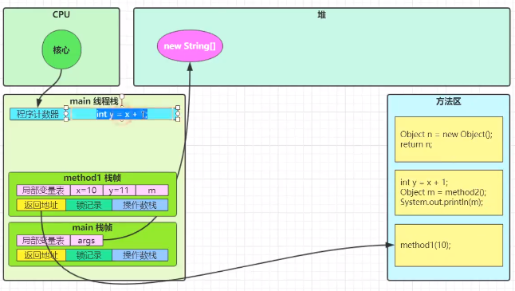
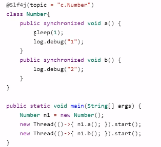

# JUC

## 进程与线程

### 概念

#### 进程与线程

**进程**

	

**线程**

	

**对比**

- 进程基本上相互独立，线程存在于进程之内，是进程的一个子集
- 进程拥有共享资源，如内存空间等，供其内部的线程共享
- 进程通信较为复杂
  - 同一台计算机的进程通信称为IPC（inter-process communication）
  - 不同计算机之间的进程通信需要通过网络，并遵循共同的协议，如HTTP
- 线程通信相对简单，他们共享进程内的内存，多个线程可以访问同一个共享变量
- 线程更轻量，线程上下文切换成本一般上比进程上下文切换成本低。

#### 并行与并发

**并发**

单核 cpu 下，线程实际还是**串行执行** 的。操作系统中有一个组件叫任务调度器，将 cpu 的时间片（windows 下时间片最小约为 15 ms） 分给不同的线程使用，一般会将 **线程轮流使用 CPU ** 的做法叫 ***并发***  

 

 

**并行**

多核 cpu 下， 每个核都可以调度运行线程， 这时候线程可以是 ***并行***

 

 

#### 应用

 

 

 

## Java线程

### 创建与运行线程

#### 方法一：直接使用 Thread

 

#### 方法二：使用 Runnable 配合 Thread

把【线程】和【任务】代码分开

- Thread 代表线程
- Runnable 可运行的任务

 

#### Thread 与 Runnable 的关系

- 方法1 是把线程和任务合并在一起了，方法2 是把线程和任务分开了
- 用 Runnable 更容易与线程池等高级 API 配合
- 用 Runnable 让任务脱离了 Thread 继承体系，更灵活

#### 方法三：FutureTask 配合 Thread

FutureTask 能接收 Callable 类型的参数，用来处理有返回结果的情况

 

### 查看进程线程的方法

#### Windows

- 任务管理器
- tasklist 查看进程
- taskkill 杀死进程

#### Linux

- ***ps -fe***  查看所有进程
- ***ps -fT -p <PID>***  查看某个进程的所有线程
- kill 杀死进程
- top 按大写 H 切换是否显示线程
- ***top -H -p <PID>*** 查看某个进程的所有线程

#### Java

- ***jps*** 查看所有Java进程
- ***jstack <PID>*** 查看某个Java进程的所有线程状态
- ***jconsole*** 查看某个Java进程中线程的运行情况

 

### *原理——线程运行

#### 栈与栈帧

每个线程的启动后，虚拟机都会为其分配一块栈内存

- 每个栈由多个栈帧（Frame）组成， 对应着每次方法调用时所占用的内存
- 每个线程只能有一个活动栈帧，对应着当前正在执行的那个方法

**图解** 

 

 

 

 

 

 

 

 

 

#### 线程上下文切换（Thread Context Switch)

**导致cpu不在执行当前线程原因**

1. 线程的cpu 时间片用完
2. 垃圾回收
3. 有更高优先级的线程需要运行
4. 线程自己调用了sleep、yield、wait、join、park、synchronized、lock等方法

当Context Switch 发生时，需要由操作系统保存当前线程的状态，并恢复另一个线程的状态，Java中对应的概念就是程序计数器。

1. 状态包括程序计数器、虚拟机栈中每个栈帧的信息、如局部变量表、操作数栈、返回地址等
2. Context Switch 频繁会影响性能

**图解**

主线程时间片耗尽

 

切换线程，保存状态

 

t1线程时间片耗尽，切换回main线程

 

### 常见方法

 

 

#### start 与 run 

 

#### sleep 与 yield

##### sleep

1. 调用sleep会让当前线程从 Running 进入 Time Waiting 状态

    

    

2. 其他线程可以使用 interrupt 方法打断正在睡眠的线程，这时 sleep 方法会抛出 InterruptedException

    

    

3. 睡眠结束后的线程未必会立刻得到执行

4. 建议用 TimeUnit 的 sleep 代替 Thread 的 sleep 来获取更好的可读性

    

   **TimeUnit sleep 内部实现** 

    

##### yield

1. 调用 yield 会让当前线程从 Running 进入 Runnable 状态，然后调度执行其他同优先级的线程，如果这时没有同优先级的线程，那么不能保证让当前线程暂停的效果
2. 具体的实现依赖于操作系统的任务调度器

##### 线程优先级

1. 线程优先级会提示（hint）调度器优先调度该线程，但它仅仅说提示，调度器可以忽略它
2. 如果 cpu 繁忙，那么优先级高的线程会获得更多的时间片，如果 cpu 空闲，优先级几乎没有作用

 

 

##### *案例-防止CPU占用100% 

 

#### join

 

 

 

##### *案例-应用同步 

 

##### 有时效的join

当时效小于实际线程结束时间时，join按照输入时间提前结束

但时效大于实际线程结束时间时，join按照实际线程结束实际结束

#### interrupt

##### 打断sleep、wait、join线程

 

 

打断标记可以被用来使线程停止

##### *设计模式-两阶段终止 

**Two Phase Termination** 

在一个线程 T1 中通知 T2 终止， T2 处理完自行终止

**错误思路** 

 

**实现思路**

 

 

##### 打断patk线程

 

如果打断标记为true，则park会失效，此时应该配合Interrupted方法使用而不是isInterrupted

- 使用isInterrupted  

   

- 使用interrupted

   

   

### 不推荐使用方法

 

### 主线程与守护线程

默认情况下，Java 进程需要等待所有线程都运行结束，才会结束。但有一种特殊的线程叫 **守护线程** 只要其他非守护线程运行结束，即使守护线程的代码没有执行完，守护线程也会强制结束。

 

**守护线程常见应用**

- 垃圾回收器线程
- Tomcat 中的 Acceptor 和 Pooler 线程都是守护线程

### 线程状态

#### 五种状态

从 **操作系统** 层面描述

 

 

#### 六种状态

从 **Java API** 层面描述

根据 Thread State 枚举，分为六种状态

 

 

### 本章小结

 

## 共享模型之管程

### 共享带来的问题

#### 小故事

 

 

 

#### Java 的体现

 

#### 问题分析

 

 

 

 

 

 

#### 临界区 Critical Section

- 一个程序运行多个线程本身没有问题
- 问题出在多个线程访问共享资源
  - 多个线程读共享资源也没有问题
  - 在多个线程对共享资源读写操作时发生指令交错，就会出现问题
- 一段代码块内如果存在对共享资源的多线程读写操作，称这段代码块为 **临界区** 

 

#### 竟态条件 Race Condition

多个线程在临界区内执行，由于代码的执行序列不同而导致结果无法预测，称之为发生了 **竟态条件** 

### synchronized 解决方案

#### *案例-应用互斥 

 

#### synchronized语法

 

 

**图解**

 

synchronized 实际说用 **对象锁** 保证了 **临界区内代码的原子性** ，临界区内的代码对外是不可分割的，不会被线程切换所打断

### 方法上的synchronized

#### 成员方法

 

#### 静态方法

 

#### 线程八锁

考察synchronized锁住的是哪个对象

- **情况一 : 锁住this** 

  **现象** ： 直接打印1 2 或 直接打印 2 1

   

- **情况二 : 锁住this** 

  **现象** ： 一秒后打印1再打印2 或 先打印2一秒后打印1

   

- **情况三 ： 锁住a,b 的this对象**

  **现象**：3 一秒后1 2 或 3 2 一秒后 1 或 2 3 一秒后 1

   

- **情况四 ：锁住不同对象的this**

  **现象** ： 先打印2一秒后打印1

   

- **情况五 ：a锁住class对象， b锁住this**

  **现象** ： 先打印2一秒后打印1

   

- **情况六 ：锁住class对象**

  **现象** ：一秒后打印1再打印2 或 先打印2一秒后打印1

   

- **情况七 ：a锁住n1的class , b 锁住n2的this**

  **现象**：先打印2一秒后打印1

   

- **情况八 ：锁住class对象**

  **现象** ：一秒后打印1再打印2 或 先打印2一秒后打印1

   

### 变量的线程安全分析

#### 成员变量与静态变量是否线程安全？

- 如果他们没有共享，则线程安全
- 如果他们被共享了，根据他们的状态是否能够改变又分为两种情况
  - 如果只有读操作，则线程安全
  - 如果有读写操作，则这段代码是临界区，需要考虑线程安全

#### 局部变量是否线程安全？

- 局部变量是线程安全的
- 局部变量的引用对象则未必
  - 如果该对象没有逃离方法的作用访问，则线程安全
  - 如果该对象逃离方法的作用范围，需要考虑线程安全

#### 局部变量线程安全分析

- **局部变量** 

   

   

- 成员变量

   

   

   

- 局部变量引用

  当访问修饰符为 *private* 

   

   

  当访问修饰符为 *public*

   

  **情况一不会产生线程安全问题，但情况二不同，会导致list变为共享资源，从而产生线程安全问题**

#### 常见线程安全类

 

##### 线程安全类的组合-- 可能线程不安全

 

##### 不可变类线程的安全性 -- 线程安全

 

### Monitor 概念

#### Java 对象头

  

#### Monitor（监视器/管程）

  

##### *原理——synchronized

 

 

##### *原理——synchronized进阶

###### 轻量级锁

**使用场景** 如果一个对象虽然有多线程访问，但多线程访问的时候是错开的（没有竞争对象），可以使用轻量级锁

 

       

###### 锁膨胀

如果在尝试加轻量级锁的过程中，CAS操作无法成功，这时一种情况就是有其他线程为此对象加上了轻量级锁（有竞争），这时需要进行锁膨胀，将轻量级锁变为重量级锁

   

###### 自旋优化

重量级锁竞争的时候还可以使用自旋来进行优化，如果当前线程自旋成功（这时候持锁进程已经退出了同步块，释放了锁），这时当前线程就可以避免阻塞

 

 

 

###### 偏向锁

轻量级锁在没有竞争时（就自己这个线程），每次重入仍然需要执行CAS操作

Java6中引入偏向锁来做进一步优化，只有第一次使用CAS将线程ID设置到对象的Mark Word 头，之后发现这个线程ID是自己的就表示没有竞争，不用重新CAS. 以后只要不发生竞争，这个对象就归该线程所有

 

 

 

 

 

   

 

 

 

###### 锁消除

 

JIT 进行锁消除优化

 

去除锁消除优化

 

### wait notify

#### 小故事

  

#### *原理——wait / notify

 

#### API

 

#### sleep（long n）和 wait (long n)的区别

- sleep 是 Thread 方法，而 wait 是 Object 的方法
- sleep 不需要强制和 synchronized 配合使用，但 wait 需要和 synchronized 一起使用
- sleep 在睡眠的同时，不会释放对象锁，但 wait 在等待的时候会释放对象锁
- 状态都是 TIME_WAITING

#### 使用方式

 

#### *设计模式-保护性暂停 

**Guarded Suspension** 

用在一个线程等待另一个线程的执行结果

**实现要点**

 

 

**超时等待** 

 

#### *原理——join

 

#### *设计模式-生产者/消费者 

该模式为异步模式，保护性暂停为同步模式

**实现要点** 

 

### park & Unpark

#### 基本使用

 

  

#### 特点

 

#### *原理——park & unpark

      

### 重理解线程状态转换

 

 

 

 

 

 

 

 

 

 

 

### 多把锁

#### 多把不相干的锁

 

 

**结论**

将锁的粒度细分（业务不相干才能细分）

- 好处，可以增强并发度
- 坏处，如果一个线程需要同时获得多把锁，容易发生死锁

### 活跃性

#### 死锁

 

#### 解决方案

**死锁图解**

 

**顺序加锁 --- 产生饥饿** 

 

#### 哲学家就餐问题

 

#### 活锁

两个线程互相改变对方的结束条件，最后谁也无法结束

 

#### 饥饿

一个线程由于优先级太低，始终得不到CPU 调度执行，从而不能结束

### ReentrantLock

相对于synchronized 它具有如下特点

- 可中断
- 可设置超时时间
- 可设置为公平锁
- 支持多个条件变量

与 synchronized 一样，都支持可重入

**基本语法**

 

#### 可重入

同一个线程如果首次获得了这把锁，那么因为它是这把锁的拥有者，因此有权利再次获取这把锁，如果是不可重入锁，那么第二次获得锁时，自己也会被锁挡住

#### 可打断

#### 锁超时

 

#### 公平锁

ReentrantLock 默认不公平

 

公平锁一般没有必要，会降低并发度

#### 条件变量

 

#### *设计模式-顺序控制 

##### 固定运行顺序

先t2 后 t1

**wait - notify** 

 

**park & unpark**

 

**await - signal**

**交替输出**

线程1 输出  a 5 次，线程 2 输出 b 5 次 ，线程 3 输出 c 5次，现在要求按照 abcabcabc。。。 的顺序输出

**wait notify**

 

**await - signal**

 

**park & unpark** 

 

### 本章小结

  
