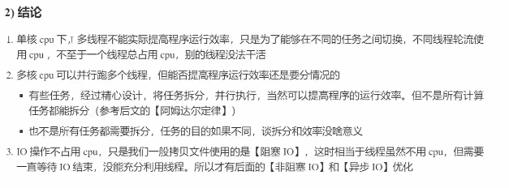
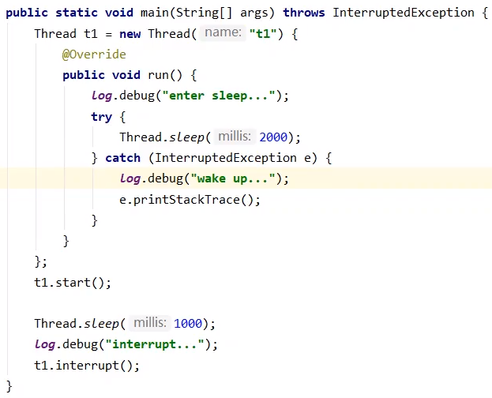
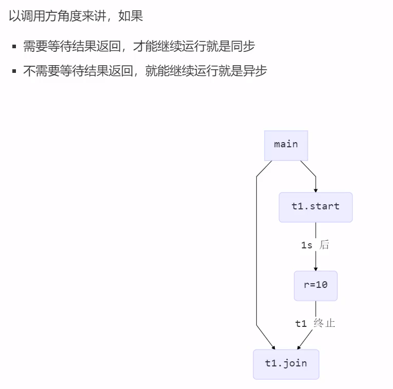
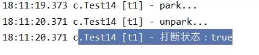
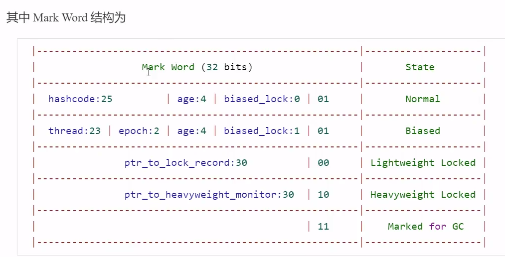
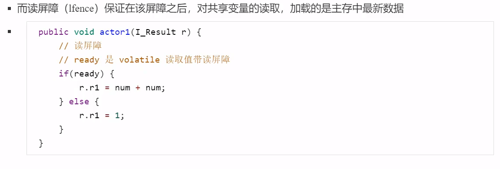
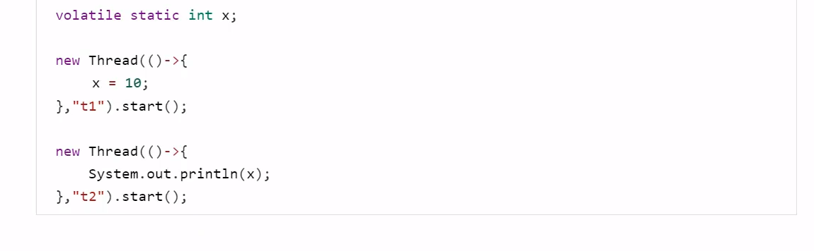
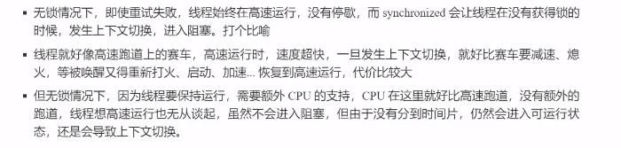
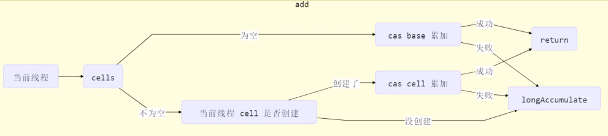

# JUC

## 进程与线程

### 概念

#### 进程与线程

**进程**

	

**线程**

	

**对比**

- 进程基本上相互独立，线程存在于进程之内，是进程的一个子集
- 进程拥有共享资源，如内存空间等，供其内部的线程共享
- 进程通信较为复杂
  - 同一台计算机的进程通信称为IPC（inter-process communication）
  - 不同计算机之间的进程通信需要通过网络，并遵循共同的协议，如HTTP
- 线程通信相对简单，他们共享进程内的内存，多个线程可以访问同一个共享变量
- 线程更轻量，线程上下文切换成本一般上比进程上下文切换成本低。

#### 并行与并发

**并发**

单核 cpu 下，线程实际还是**串行执行** 的。操作系统中有一个组件叫任务调度器，将 cpu 的时间片（windows 下时间片最小约为 15 ms） 分给不同的线程使用，一般会将 **线程轮流使用 CPU ** 的做法叫 ***并发***  

 

 

**并行**

多核 cpu 下， 每个核都可以调度运行线程， 这时候线程可以是 ***并行***

 

 

#### 应用

 

 

 

## Java线程

### 创建与运行线程

#### 方法一：直接使用 Thread

 

#### 方法二：使用 Runnable 配合 Thread

把【线程】和【任务】代码分开

- Thread 代表线程
- Runnable 可运行的任务

 

#### Thread 与 Runnable 的关系

- 方法1 是把线程和任务合并在一起了，方法2 是把线程和任务分开了
- 用 Runnable 更容易与线程池等高级 API 配合
- 用 Runnable 让任务脱离了 Thread 继承体系，更灵活

#### 方法三：FutureTask 配合 Thread

FutureTask 能接收 Callable 类型的参数，用来处理有返回结果的情况

 

### 查看进程线程的方法

#### Windows

- 任务管理器
- tasklist 查看进程
- taskkill 杀死进程

#### Linux

- ***ps -fe***  查看所有进程
- ***ps -fT -p <PID>***  查看某个进程的所有线程
- kill 杀死进程
- top 按大写 H 切换是否显示线程
- ***top -H -p <PID>*** 查看某个进程的所有线程

#### Java

- ***jps*** 查看所有Java进程
- ***jstack <PID>*** 查看某个Java进程的所有线程状态
- ***jconsole*** 查看某个Java进程中线程的运行情况

 

### *<font color="#FF5151">原理——线程运行</font>

#### 栈与栈帧

每个线程的启动后，虚拟机都会为其分配一块栈内存

- 每个栈由多个栈帧（Frame）组成， 对应着每次方法调用时所占用的内存
- 每个线程只能有一个活动栈帧，对应着当前正在执行的那个方法

**图解** 

 

 

 

 

 

 

 

 

 

#### 线程上下文切换（Thread Context Switch)

**导致cpu不在执行当前线程原因**

1. 线程的cpu 时间片用完
2. 垃圾回收
3. 有更高优先级的线程需要运行
4. 线程自己调用了sleep、yield、wait、join、park、synchronized、lock等方法

当Context Switch 发生时，需要由操作系统保存当前线程的状态，并恢复另一个线程的状态，Java中对应的概念就是程序计数器。

1. 状态包括程序计数器、虚拟机栈中每个栈帧的信息、如局部变量表、操作数栈、返回地址等
2. Context Switch 频繁会影响性能

**图解**

主线程时间片耗尽

 

切换线程，保存状态

 

t1线程时间片耗尽，切换回main线程

 

### 常见方法

 

 

#### start 与 run 

 

#### sleep 与 yield

##### sleep

1. 调用sleep会让当前线程从 Running 进入 Time Waiting 状态

    

    

2. 其他线程可以使用 interrupt 方法打断正在睡眠的线程，这时 sleep 方法会抛出 InterruptedException

    

    

3. 睡眠结束后的线程未必会立刻得到执行

4. 建议用 TimeUnit 的 sleep 代替 Thread 的 sleep 来获取更好的可读性

    

   **TimeUnit sleep 内部实现** 

    

##### yield

1. 调用 yield 会让当前线程从 Running 进入 Runnable 状态，然后调度执行其他同优先级的线程，如果这时没有同优先级的线程，那么不能保证让当前线程暂停的效果
2. 具体的实现依赖于操作系统的任务调度器

##### 线程优先级

1. 线程优先级会提示（hint）调度器优先调度该线程，但它仅仅说提示，调度器可以忽略它
2. 如果 cpu 繁忙，那么优先级高的线程会获得更多的时间片，如果 cpu 空闲，优先级几乎没有作用

 

 

##### <font color=" #28FF28">*案例-防止CPU占用100%</font> 

 

#### join

 

 

 

##### <font color=" #28FF28">*案例-应用同步</font> 

 

##### 有时效的join

当时效小于实际线程结束时间时，join按照输入时间提前结束

但时效大于实际线程结束时间时，join按照实际线程结束实际结束

#### interrupt

##### 打断sleep、wait、join线程

 

 

打断标记可以被用来使线程停止

##### *<font color=" FF9D6F">设计模式-两阶段终止</font> 

**Two Phase Termination** 

在一个线程 T1 中通知 T2 终止， T2 处理完自行终止

**错误思路** 

 

**实现思路**

 

 

##### 打断patk线程

 

如果打断标记为true，则park会失效，此时应该配合Interrupted方法使用而不是isInterrupted

- 使用isInterrupted  

   

- 使用interrupted

   

   

### 不推荐使用方法

 

### 主线程与守护线程

默认情况下，Java 进程需要等待所有线程都运行结束，才会结束。但有一种特殊的线程叫 **守护线程** 只要其他非守护线程运行结束，即使守护线程的代码没有执行完，守护线程也会强制结束。

 

**守护线程常见应用**

- 垃圾回收器线程
- Tomcat 中的 Acceptor 和 Pooler 线程都是守护线程

### 线程状态

#### 五种状态

从 **操作系统** 层面描述

 

 

#### 六种状态

从 **Java API** 层面描述

根据 Thread State 枚举，分为六种状态

 

 

### 本章小结

 

## 共享模型之管程

### 共享带来的问题

#### 小故事

 

 

 

#### Java 的体现

 

#### 问题分析

 

 

 

 

 

 

#### 临界区 Critical Section

- 一个程序运行多个线程本身没有问题
- 问题出在多个线程访问共享资源
  - 多个线程读共享资源也没有问题
  - 在多个线程对共享资源读写操作时发生指令交错，就会出现问题
- 一段代码块内如果存在对共享资源的多线程读写操作，称这段代码块为 **临界区** 

 

#### 竟态条件 Race Condition

多个线程在临界区内执行，由于代码的执行序列不同而导致结果无法预测，称之为发生了 **竟态条件** 

### synchronized 解决方案

#### <font color=" #28FF28">*案例-应用互斥</font> 

 

#### synchronized语法

 

 

**图解**

 

synchronized 实际说用 **对象锁** 保证了 **临界区内代码的原子性** ，临界区内的代码对外是不可分割的，不会被线程切换所打断

### 方法上的synchronized

#### 成员方法

 

#### 静态方法

 

#### 线程八锁

考察synchronized锁住的是哪个对象

- **情况一 : 锁住this** 

  **现象** ： 直接打印1 2 或 直接打印 2 1

   

- **情况二 : 锁住this** 

  **现象** ： 一秒后打印1再打印2 或 先打印2一秒后打印1

   

- **情况三 ： 锁住a,b 的this对象**

  **现象**：3 一秒后1 2 或 3 2 一秒后 1 或 2 3 一秒后 1

   

- **情况四 ：锁住不同对象的this**

  **现象** ： 先打印2一秒后打印1

   

- **情况五 ：a锁住class对象， b锁住this**

  **现象** ： 先打印2一秒后打印1

   

- **情况六 ：锁住class对象**

  **现象** ：一秒后打印1再打印2 或 先打印2一秒后打印1

   

- **情况七 ：a锁住n1的class , b 锁住n2的this**

  **现象**：先打印2一秒后打印1

   

- **情况八 ：锁住class对象**

  **现象** ：一秒后打印1再打印2 或 先打印2一秒后打印1

   

### 变量的线程安全分析

#### 成员变量与静态变量是否线程安全？

- 如果他们没有共享，则线程安全
- 如果他们被共享了，根据他们的状态是否能够改变又分为两种情况
  - 如果只有读操作，则线程安全
  - 如果有读写操作，则这段代码是临界区，需要考虑线程安全

#### 局部变量是否线程安全？

- 局部变量是线程安全的
- 局部变量的引用对象则未必
  - 如果该对象没有逃离方法的作用访问，则线程安全
  - 如果该对象逃离方法的作用范围，需要考虑线程安全

#### 局部变量线程安全分析

- **局部变量** 

   

   

- 成员变量

   

   

   

- 局部变量引用

  当访问修饰符为 *private* 

   

   

  当访问修饰符为 *public*

   

  **情况一不会产生线程安全问题，但情况二不同，会导致list变为共享资源，从而产生线程安全问题**

#### 常见线程安全类

 

##### 线程安全类的组合-- 可能线程不安全

 

##### 不可变类线程的安全性 -- 线程安全

 

### Monitor 概念

#### Java 对象头

  

#### Monitor（监视器/管程）

  

##### *<font color="#FF5151">原理——synchronized</font>

 

 

##### *<font color="#FF5151">原理——synchronized进阶</font>

###### 轻量级锁

**使用场景** 如果一个对象虽然有多线程访问，但多线程访问的时候是错开的（没有竞争对象），可以使用轻量级锁

 

       

###### 锁膨胀

如果在尝试加轻量级锁的过程中，CAS操作无法成功，这时一种情况就是有其他线程为此对象加上了轻量级锁（有竞争），这时需要进行锁膨胀，将轻量级锁变为重量级锁

   

###### 自旋优化

重量级锁竞争的时候还可以使用自旋来进行优化，如果当前线程自旋成功（这时候持锁进程已经退出了同步块，释放了锁），这时当前线程就可以避免阻塞

 

 

 

###### 偏向锁

轻量级锁在没有竞争时（就自己这个线程），每次重入仍然需要执行CAS操作

Java6中引入偏向锁来做进一步优化，只有第一次使用CAS将线程ID设置到对象的Mark Word 头，之后发现这个线程ID是自己的就表示没有竞争，不用重新CAS. 以后只要不发生竞争，这个对象就归该线程所有

 

 

 

 

 

   

 

 

 

###### 锁消除

 

JIT 进行锁消除优化

 

去除锁消除优化

 

### wait notify

#### 小故事

  

#### *<font color="#FF5151">原理——wait / notify</font>

 

#### API

 

#### sleep（long n）和 wait (long n)的区别

- sleep 是 Thread 方法，而 wait 是 Object 的方法
- sleep 不需要强制和 synchronized 配合使用，但 wait 需要和 synchronized 一起使用
- sleep 在睡眠的同时，不会释放对象锁，但 wait 在等待的时候会释放对象锁
- 状态都是 TIME_WAITING

#### 使用方式

 

#### *<font color=" FF9D6F">设计模式-保护性暂停</font> 

**Guarded Suspension** 

用在一个线程等待另一个线程的执行结果

**实现要点**

 

 

**超时等待** 

 

#### *<font color="#FF5151">原理——join</font>

 

#### *<font color=" FF9D6F">设计模式-生产者/消费者</font> 

该模式为异步模式，保护性暂停为同步模式

**实现要点** 

 

### park & Unpark

#### 基本使用

 

  

#### 特点

 

#### *<font color="#FF5151">原理——park & unpark</font>

      

### 重理解线程状态转换

 

 

 

 

 

 

 

 

 

 

 

### 多把锁

#### 多把不相干的锁

 

 

**结论**

将锁的粒度细分（业务不相干才能细分）

- 好处，可以增强并发度
- 坏处，如果一个线程需要同时获得多把锁，容易发生死锁

### 活跃性

#### 死锁

 

#### 解决方案

**死锁图解**

 

**顺序加锁 --- 产生饥饿** 

 

#### 哲学家就餐问题

 

#### 活锁

两个线程互相改变对方的结束条件，最后谁也无法结束

 

#### 饥饿

一个线程由于优先级太低，始终得不到CPU 调度执行，从而不能结束

### ReentrantLock

相对于synchronized 它具有如下特点

- 可中断
- 可设置超时时间
- 可设置为公平锁
- 支持多个条件变量

与 synchronized 一样，都支持可重入

**基本语法**

 

#### 可重入

同一个线程如果首次获得了这把锁，那么因为它是这把锁的拥有者，因此有权利再次获取这把锁，如果是不可重入锁，那么第二次获得锁时，自己也会被锁挡住

#### 可打断

#### 锁超时

 

#### 公平锁

ReentrantLock 默认不公平

 

公平锁一般没有必要，会降低并发度

#### 条件变量

 

#### *<font color=" FF9D6F">设计模式-顺序控制</font> 

##### 固定运行顺序

先t2 后 t1

**wait - notify** 

 

**park & unpark**

 

**await - signal**


**交替输出**

线程1 输出  a 5 次，线程 2 输出 b 5 次 ，线程 3 输出 c 5次，现在要求按照 abcabcabc。。。 的顺序输出

**wait notify**

 

**await - signal**

 

**park & unpark** 

 

### 本章小结

  

## 共享模型之内存

### Java内存模型（JMM）

从Java层面定义了主存，工作内存抽象概念，底层对应着CPU寄存器、缓存、硬件内存、CPU指令优化等

**JMM 体现在以下几个方面**

- 原子性：保证指令不会受到线程上下文切换的影响
- 可见性：保证指令不会受 CPU 缓存的影响
- 有序性：保证指令不会受 CPU 指令并行优化的影响

### 可见性

#### 退不出的循环

main 线程对 run 变量的修改对于 t  线程不可见，导致了 t 线程无法停止

 

**分析**

   

#### 解决方法

volatile（易变关键字）

它可以用来修饰成员变量和静态成员变量，他可以避免线程从自己的工作缓存中查找变量的值，必须到主存中获取它的值，线程操作 volatile 变量直接操作主存

#### 可见性 vs 原子性

  

**注意**

synchronized 语句块既可以保证代码块的原子性，也同时保证代码块内变量的可见性，但synchronized属于重量级操作，性能相对更低

#### *<font color=" FF9D6F">设计模式-Balking</font> 


用来实现线程安全的单例

 

### 有序性

JVM在不影响正确性的前提下，会调整语句的执行顺序

 

#### *<font color="#FF5151">原理——指令级并行</font>

 

 

### *<font color="#FF5151">原理——volatile</font>

volatile 底层实现原理是内存屏障，Memory Barrier （Memory Fence）

- 对volatile变量的写指令后会加入写屏障
- 对volatile变量的读指令前会加入读屏障

#### 保证可见性

   

#### 保证有序性

   

#### double-checked locking 问题

 

**改进**

 

发生指令重排

 

第0行 getstatic 在 monitor 控制之外，当 t1 线程还未完全将构造方法执行完毕，t2 线程将拿到的是一个未完成初始化的单例 

#### double-checked locking 解决方案

增加volatile关键字阻止重排序 

 

#### happens-before

happens-before 规定了对共享变量的写操作对其他线程的读操作可见，是可见性与有序性的一套规则的总结

- 线程解锁 m 之前对变量的写，对于接下来对 m  加锁的其他线程对改变量的读可见

   

- 线程对 volatile 变量的写，对接下来其他线程对该变量的读可见

   

- 线程 start 前对变量的写，对该线程开始后对该变量的读可见

   

- 线程结束前对变量的写，对其他线程得知它结束后的读可见

   

- 线程 t1 打断 t2 （interrupt）前对变量的写，对于其他线程得知 t2 被打断后对变量的读可见

   

- 对变量默认值（0，false，null）的写，对其他线程对该变量的读可见

- 具有传递性，如果 x hb-> y 且 y hb-> z 则 x hb-> z ，配合volatile的防指令重排

#### 线程单例安全实现

     

### 本章小结

 

## 共享模型之无锁

### CAS 与 volatile

#### 无锁实现共享变量的保护 compareAndSet (CAS)

 

**实现时序图** 

 

#### volatile

 

#### 为什么无锁效率高

 

#### CAS特点

 

### 原子类

#### 原子整数

- AtomicBoolean
- AtomicInteger
- AtomicLong

**常见API**

 

 

```java
// 获取并更新，传递参数为lambda函数，可做更多运算
i.getAndUpdate(value -> value * 10); 

// 更新并获取，传递参数为lambda函数，可做更多运算
i.updateAndGet(value -> value / 10);

// 底层实现方法 通过cas实现
public final int updateAndGet(IntUnaryOperator updateFunction){
    int perv, next;
    do{
        perv = get();
        next = updateFunction.applyAsInt(perv);
    }while(!compareAndSet(prev, next));
    return next;
}
```

#### 原子引用

- AtomicReference
- AtomicMarkableReference
- AtomicStampedReference

**AtomicReference**

****

```java
class DecimalAccountCas impletemts DecimalAccount{
    private AtomicReference<BigDecimal> balance;
    
    public DecimalAccountCas(BigDecimal balance){
        this.balance = new AtomicReference<>(balance);
    }
    
    @Override
    public BigDecimal getBalance() {
        return balance.get();
    }
    
    @Override
    public void withdraw(BigDecimal amount){
        while(true){
            BigDecimal prev = balance.get();
            BigDecimal next = prev.subtract(amount); // 减去值
            if(balance.compareAndSET(prev, next))
                break;
        }
    }
}

interface DecimalAccount {
    // 获取余额
    BigDecimal getBalance();
    
    // 取款
    void withdraw(BigDecimal amount);
	
    /**
	方法内启动1000个线程，每个线程做-10的操作
    如果初始余额为10000 那么正确的结果应当是 0
     */
    static void demo(DecimalAccount account){
        List<Thread> ts = new ArrayList<>();
        for(int i = 0; i < 1000; i++){
            ts.add(new Thread(() -> {
                account.withdraw(BigDecimal.TEN);
            }));
        }
        ts.forEach(Thread::start);
        ts.forEach(t -> {
            try{
                t.join();
            } catch (InterruptException e){
                e.printStackTrace();
            }
        });
        System.out.println(account.getBalance());
    }
}
```

##### ABA问题

主线程仅能判断出共享变量的值与最初值 A 是否相同，不能感知到是否有线程将值从A -> B 又从B -> A

```java
static AtomicReference<String> ref = new AtomicReference<> ("A");
public static void main(String[] args) throws InterruptedException{
    String prev = ref.get();
    other();
    sleep(1);
    ref.compareAndSet(prev, "C");
}

private static void other(){
    new Thread(() -> {
        ref.compareAndSet(ref.get(), "B");
    }, "t1").start();
    new Thread(() -> {
         ref.compareAndSet(ref.get(), "A");
    }, "t2").start();
}
```

为了解决这种问题，只需要在其中加一个版本号，可以追踪原子引用整个变化的过程

**AtomicStampedReference**

```java
static AtomicStampedReference<String> ref = new AtomicStampedReference<> ("A", 0);
public static void main(String[] args) throws InterruptedException{
    String prev = ref.getReference(); // 获取值
    int stamp = ref.getStamp(); // 获取版本号
    other();
    sleep(1);
    ref.compareAndSet(prev, "C", stamp, stamp + 1);
}

private static void other(){
    new Thread(() -> {
        int stamp = ref.getStamp(); 
        ref.compareAndSet(ref.getReference(), "B", stamp, stamp + 1);
    }, "t1").start();
    new Thread(() -> {
        int stamp = ref.getStamp(); 
         ref.compareAndSet(ref.getReference(), "A", stamp, stamp + 1);
    }, "t2").start();
}
```

如果并不关心修改多少次，只是单纯关系是否更改过，这时可以使用**AtomicMarkableReference** 它将版本号换为了布尔值

#### 原子数组

- AtomicIntegerArray
- AtomicLongArray
- AtomicReferenceArray

```java
public static void main(String[] args){
    // 线程不安全
    demo(
    	() -> new int[10],
        (array) -> array.length,
        (array, index) -> array[index]++,
        array -> System.out.println(Array.toString(array))
    );
    
    // 线程安全
    demo(
    	() -> new AtomicIntegerArray(10),
        (array) -> array.length,
        (array, index) -> array.getAndIncrement(index),
        array -> System.out.println(array)
    );
}

/*
方法内启动10个线程，并发让数组所有元素总共自增 10000 次
	参数1， 提供数组、可以是线程安全的也可以是不安全的数组
	参数2， 获取数组长度
	参数3， 自增方法，回传array， index
	参数4， 打印数组方法
*/
/*
	supplier 提供者 无中生有 （） -> 结果
	function 函数 一个参数一个结果 （参数）-> 结果	BiFunction(参数1， 参数2) -> 结果
	consumer 消费者 一个参数没结果 (参数) -> void	BiConsumer(参数1，参数2) -> void
*/
private static <T> demo(
    Supplier<T> arraySupplier,
    Function<T, Integer> lengthFun,
    BiConusumer<T, Integer> putConsumer,
    Consumer<T> printConsumer){
    List<Thread> ts = new ArrayList<>();
    T array = arraySupplier.get();
    int length = lengthFun.apply(array);
    for(int i = 0; i < length; i++){
        ts.add(new Thread(() -> {
            for(int j = 0; j < 10000; j++){
            	putConsumer.accept(array, j%length);    
            }
        }));
    }
    ts.forEach(t -> t.start());
    ts.forEach(t -> {
        try{
            t.join();
        } catch (InterruptException e){
            e.printStackTrace();
        }
    });
}
```

#### 字段更新器

- AtomicIntegerFieldUpdater
- AtomicLongFieldUpdater
- AtomicReferenceFieldUpdater

利用字段更新器可以针对对象的某个域（Field）进行原子操作，只能配合volatile修饰的字段使用，否则会出现异常

```java
Exception in thread "main" java.lang.IllegalArgumentException: Must be volatile type
```

```java
public static void main(String[] args){
    Student stu = new Student();
    AtomicReferenceFieldUpdater updater = 
    			AtomicReferenceFieldUpdater.newUpdater(Student.class, String.class, "name");
    System.out.println(updater.compareAndSet(stu, null, "张三"));
    System.out.println(stu);
}

@Data
class Student{
    String name;
}
```

#### 原子累加器

##### 累加器性能比较

```java
public static void main(String[] args){
    for(int i = 0; i < 5; i++){
        demo{
            () -> new AtomicLong(0),
            (adder) -> adder.getAndIncrement()
        };
    }
    for(int i = 0; i < 5; i++){
        demo{
            () -> new LongAdder(),
            (adder) -> adder.increment()
        };
    }
}

private static <T> void demo(Supplier<T> adderSupplier, Consumer<T> action){
    T adder = adderSupplier.get();
    long start = System.nanoTime();
    List<Thread> ts = new ArrayList<>();
    for(int i = 0; i < 40; i++){
        ts.add(new Thread(() -> {
            for(int j = 0; j < 500000; j++){
                action.accept(adder);
            }
        }));
    }
    ts.froEach(t -> t.start());
    ts.forEach(t -> {
        try{
            t.join();
        } catch (InterruptException e){
            e.printStackTrace();
        }
    });
    long end = System.nanoTime();
    System.out.println(adder + " cosst:" + (end - start)/1000_000);
}
```

 

 

##### 源码—— LongAdder

LongAdder 关键域

```java
// 累加单元数组， 懒惰初始化
transient volatile Cell[] cells;

// 基础值，如果没有竞争，则用cas累加这个域
transient volatile long base;

// 在cells创建或扩容时， 置为 1 ， 表示加锁
transient volatile int cellsBusy;
```

**cas 实现锁**

```java
public class LockCas{
 	private AtomicInteger state = new AtomicInteger(0);
    
    public void lock(){
        while(true){
            if(state.compareAndSet(0, 1))
                break;
        }
    }
    
    public void unlock(){
        System.out.println("unlock....");
        state.set(0);
    }
    
    public static void main(String[] args){
        LockCas lock = new LockCas();
        new Thread(() -> {
            System.out.println("begin....");
            lock.lock();
            try{
                System.out.println("lock....");
                sleep(1);
            }finally{
                lock.unlock();
            }
        }, "t1").start();
        
        new Thread(() -> {
            System.out.println("begin....");
            lock.lock();
            try{
                System.out.println("lock....");
            }finally{
                lock.unlock();
            }
        }, "t2").start();
    }
}
```

**cell实现**

```java
// 防止缓存行伪共享
@sun.misc.Contended
static final class Cell{
    volatile long value;
    Cell(long x){ value = x };
    // 通过cas方式进行累加,prev表示旧值， next表示新值
    final boolean cas(long prev, long next){
        return UNSAFE.compareAndSwapLong(this, valueOffset, perv, next);
    }
}
```

     

**add() **

```java
public void add(long x){
    Cell[] as;
    long b, v;
    int m;
    Cell a;
    if((as = cells) != null || !casBase(b = base, b + x)){
        boolean uncontended = true;
        if(as == null || (m = as.length - 1) < 0 ||
          (a = as[getProbe() & m]) == null ||
           !(uncontended = a.cas(v= a.value, v + x))){
            	longAccumulate(x, null, uncontended);
        }
    }
}
```

 

**longAccumulate() **

```java
final void longAccumulate(long x, LongBinaryOperator fn,
                              boolean wasUncontended) {
    int h;
    if ((h = getProbe()) == 0) {
        ThreadLocalRandom.current(); // force initialization
        h = getProbe();
        wasUncontended = true;
    }
    boolean collide = false;                // True if last slot nonempty
    done: for (;;) {
        Cell[] cs; Cell c; int n; long v;
        if ((cs = cells) != null && (n = cs.length) > 0) {
            if ((c = cs[(n - 1) & h]) == null) {
                if (cellsBusy == 0) {       // Try to attach new Cell
                    Cell r = new Cell(x);   // Optimistically create
                    if (cellsBusy == 0 && casCellsBusy()) {
                        try {               // Recheck under lock
                            Cell[] rs; int m, j;
                            if ((rs = cells) != null &&
                                (m = rs.length) > 0 &&
                                rs[j = (m - 1) & h] == null) {
                                rs[j] = r;
                                break done;
                            }
                        } finally {
                            cellsBusy = 0;
                        }
                        continue;           // Slot is now non-empty
                    }
                }
                collide = false;
            }
            else if (!wasUncontended)       // CAS already known to fail
                wasUncontended = true;      // Continue after rehash
            else if (c.cas(v = c.value,
                           (fn == null) ? v + x : fn.applyAsLong(v, x)))
                break;
            else if (n >= NCPU || cells != cs)
                collide = false;            // At max size or stale
            else if (!collide)
                collide = true;
            else if (cellsBusy == 0 && casCellsBusy()) {
                try {
                    if (cells == cs)        // Expand table unless stale
                        cells = Arrays.copyOf(cs, n << 1);
                } finally {
                    cellsBusy = 0;
                }
                collide = false;
                continue;                   // Retry with expanded table
            }
            h = advanceProbe(h);
        }
        else if (cellsBusy == 0 && cells == cs && casCellsBusy()) {
            try {                           // Initialize table
                if (cells == cs) {
                    Cell[] rs = new Cell[2];
                    rs[h & 1] = new Cell(x);
                    cells = rs;
                    break done;
                }
            } finally {
                cellsBusy = 0;
            }
        }
        // Fall back on using base
        else if (casBase(v = base,
                         (fn == null) ? v + x : fn.applyAsLong(v, x)))
            break done;
    }
}
```

 

 

 

**sum() **

```java
public long sum() {
    Cell[] as = cells; Cell a;
    long sum = base;
    if (as != null) {
        for (int i = 0; i < as.length; ++i) {
            if ((a = as[i]) != null)
                sum += a.value;
        }
    }
    return sum;
}
```

### unsafe

unsafe对象提供了非常底层的操作内存、线程的方法，unsafe对象不能直接调用

 

#### unsafe cas操作

 

### 本章小结

 

