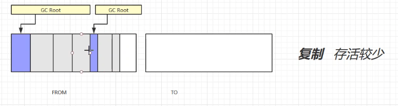
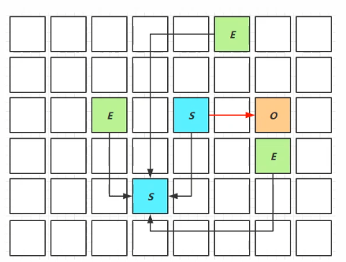
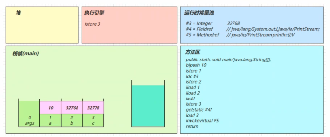
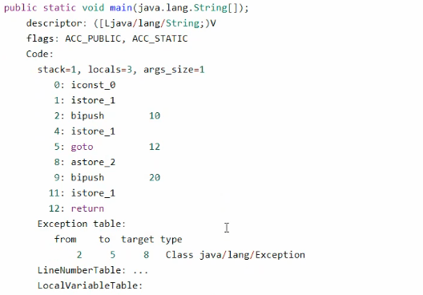
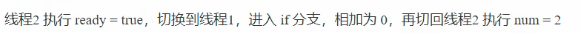

# JVM

##  什么是jvm

###  好处

1. 一次编写，处处运行
2. 自动内存管理，垃圾回收功能
3. 数组下标越界越界检查
4. 多态

###  比较

**jre 、jdk 、 jvm**

	


##  为啥学习jvm？

- 面试
- 理解底层实现原理
- 中高级必备技能

##  常见jvm

	

##  学习路线

	

##  内存结构

###  程序计数器

#### 定义

**Program Counter Register** ：寄存器

#### 作用

记住下条jvm指令执行地址

	

####  特点

- 线程私有
- 不会内存溢出

###  虚拟机栈

#### 栈与栈帧

**栈** ：先进后出

线程运行时需要的内存空间

**栈帧** ： 每个方法运行时需要的内存

	

#### 定义

**Java Virtual Machine Stacks** 

- 每个线程运行时所需要的内存，称为虚拟机栈
- 每个栈由多个栈帧（Frame）组成，对应着每次方法调用时所占用的内存
- 每个线程只能有一个活动栈帧，对应着当前正在执行的那个方法

#### 常见问题

1. 垃圾回收是否涉及栈内存？

   不用，栈内存在栈帧释放后自动回收

2. 栈内存分配越大越好吗？

   不好，栈内存越大，线程越少，不会提高运行效率，只会增加方法调用数目。

3. 方法区的局部变量是否线程安全？

   	

   方法内局部变量 **x** 线程私有，不会存在线程安全。

   当 **x** 改变未 ***static*** 线程共享，线程不安全。

   **结论** ：

   - 如果方法内部局部变量没有逃离方法的作用范围，线程安全
   - 如果局部变量引用了对象，并逃离方法的作用范围，需要考虑线程安全性

#### 栈内存溢出(StackOverFlowError)

1. 栈帧过多，递归调用中容易发生

2. 栈帧过大，比如栈大小4k，栈帧大小128k

   **注**：栈默认大小mac, linux, oracle 1024k,win看虚拟机大小

#### 线程运行诊断

#### cpu占用过多

1. Linux中使用 **top** 检测cpu使用情况
2. ps H -eo pid, tid, %cpu | grep 进程号 排查cpu高占用线程
3. jstack 进程id 查看该进程下所有线程
4. 将问题进程id换算为十六进制在jstack中寻找相应线程，定位cpu占用过高代码位置

####  线程死锁问题排查

1. jstack 进程id 查看该进程下所有线程
2. 在最后输出位置查看是否存在 ***Found one Java-level deadlock***  

###  本地方法栈

给本地方法的运行提供内存空间

### 堆

#### 定义

1. 通过new关键字，创建对象都会使用堆内存

#### 特点

1. 线程共享，堆中对象需要考虑线程安全
2. 有垃圾回收机制

#### 堆内存溢出

**检查方法** 将虚拟机堆内存设置变小-Xxm8m

#### 堆内存诊断

1. jps工具
   1. 查看系统中有哪些Java进程
2. jmap工具
   1. 查看堆内存占用情况 *jmap -heap 进程ID*
3. jconsole工具
   1. 图形工具，多功能监测工具可以连续监测

### 方法区

#### 定义

1. 共享区域，储存类信息，类加载器，常量池信息
2. 虚拟机启动时创建，逻辑上是堆得一部分，例如永久代为堆上，元空间为本地内存

   	

#### 内存溢出

##### 1.8元空间溢出

	

##### 1.6永久代溢出

	

#### 运行时常量池

- 一张表，虚拟机指令根据这张常量表找到要执行的类名，方法名，参数类型，字面量等信息
- 运行时常量池是  *.class 文件中的，当该类被加载，他的常量池信息就会放入运行时常量池，并把里面的符合地址变为真实地址

#### StringTable

	

```java
System.out.println(s3 == s4);
return false;

System.out.println(s3 == s5);
return true;
```

当出现一个新的未出现过的串，放入StringTable,执行一行后才进行懒加载。

##### intern方法

**1.8**

将这个字符串对象尝试放入串池，如果有则不会放入，如果没有则放入串池，会把串池中的对象返回

**1.6**

将这个字符串对象尝试放入串池，如果有则不会放入，**如果没有则将此对象复制一份放入串池**，会把串池中的对象返回

##### 面试题

	

##### 性能调优

- 调整-XX:StringTableSize=桶个数
- 存在大量重复字符串时可以使字符串入池，减少堆内存的使用

### 直接内存

#### 定义

- 常见于NIO操作时，用于数据缓冲区
- 分配回收成本较高，但读写性能高
- 不受JVM内存回收管理

**普通IO**

	

**NIO**

	

## 垃圾回收

### 判断垃圾

#### 引用计数法

​	循环引用无法回收

	


#### 可达性分析

1. 确定根对象
2. 对堆中对象进行扫描，查看是否能够沿着GC Roots对象为起点找到该对象

#### 四种引用

- 强引用

  只有所有GC Roots对象都不通过 【强引用】引用该对象，该对象才能被垃圾回收

- 软引用

  - 仅有软引用引用该对象时，在垃圾回收后，内存仍不足时会再次触发垃圾回收，回收软引用对象
  - 可以配合引用队列来释放软引用自身

- 弱引用

  - 仅有弱引用引用该对象时，在垃圾回收时，无论内存是否充足，都会回收弱引用对象
  - 可以配合引用队列来释放弱引用自身

- 虚引用

  - 必须配合引用队列使用，主要配合ByteBuffer使用，被引用对象回收时，会将虚引用入队，由Refernce Handler 线程调用虚引用相关方法释放直接内存

- 终结器引用

  - 无需手动编码，但其内部配合引用队列使用，在垃圾回收时，终结器引用入队（被引用对象暂时没有被回收），再由Finalizer 线程通过终结器引用找到被引用对象并调用它的finalize方法，第二次GC时才能被回收引用对象
  
    	

### 垃圾回收算法

#### 标记清除（Mark Swap）

	

**优点** 速度快

**缺点** 容易产生碎片

#### 标记整理（Mark Compact）

	

**优点** 没有碎片

**缺点** 速度慢

#### 复制（Copy）

1. 标记

   	

2. 复制清除

   	

3. 交换分区

   	

**优点** 不会产生碎片

**缺点** 占用双倍内存空间

### 分代垃圾回收

#### 流程

	

1. 对象首先分配在Eden区
2. 新生代空间不足，触发 Minor GC, Eden 和 From 存活的对象使用 copy 复制到 to 中，存活的对象年龄加一，并交换 From 和 to
3. Minor GC 会引发 stop the world, 暂停其他用户线程，等垃圾回收结束，用户线程恢复运行
4. 当对象寿命超过阈值时，会晋升至老年代，最大寿命15（5bit）
5. 当 老年代空间不足，尝试触发 Minor GC 如果之后空间仍不足触发 Full GC ,STW时间加长

#### 相关VM参数

	

#### 大对象

当新生对象过于大时，超出了新生代限制，则直接分配到老年代区域

当一个线程内发生OutOfMemory并不会影响主线程

### 垃圾回收器

#### 串行（Servial、Servial Old）

- 单线程
- 堆内存较小，适合个人电脑

  	

#### 吞吐量优先(Parallel  Scavenge、Parallel Old)

- 多线程
- 堆内存较大，多核cpu支持
- 让单位时间内，STW时间最短

  	

#### 响应时间优先(ParNew、CMS【ConcurrentMarkSwap】--> Serial Old)

- 多线程
- 堆内存较大，多核cpu支持
- 注重垃圾回收时单次STW尽可能时间短

  	

内存碎片过多CMS退化为Serial Old响应时间增长

#### G1(Garbage First)

- 注重吞吐量和低延迟，默认的暂停目标是200ms
- 超大堆内存，将堆划分为多个大小相等的Region
- 整体上是标记+整理算法，两个区域间复制算法

  	

1. **垃圾回收阶段**

   	

2. **Young Collection**

- 会STW
  1. 在Eden区创建
  
      
  
  2. 经过垃圾回收后复制到幸存区
  
      
  
  3. 将多次经过垃圾回收的复制到老年代
  
      

3. **Young Collection + CM**
   - 在Young GC时进行GC Root 的初始标记
   - 老年代占用堆空间比例达到阈值时，进行并发标记（不会STW），由下面的JVM参数决定

 

4. **Mixed Collection**

会对E、S、O进行全面垃圾回收

- 最终标记（Remark）会STW
- 拷贝存活（Evacuation）会STW

 

5. **Young Collection 跨代引用**

   - 老年代引用新生代

    

   - currentTable与Remember Set
   - 在引用变量时通过post-write barrier+dirty card queue
   - concurrent refinement threads 更新 Remember Set

    

6. **JDK 8u20 字符串去重**

   - 优点：节省大量内存
   - 缺点：略微多占用cpu时间，新生代回收时间略微增加

    

7. **JDK 8u40 并发标记类卸载**

   所有对象都经过并发标记后，就能知道那些类不再被使用，当一个类加载器的所有类都不在使用，则卸载它所加载的所有类

    

8. **JDK 8u60 回收巨型对象**

   - 一个对象大于region一半时，就是巨型对象
   - G不会对巨型对象进行copy
   - 回收时优先考虑
   - G1会跟踪老年代所有incoming引用，当老年代incoming为0的巨型对象就可以在新生代垃圾回收时处理掉

    

   

### 垃圾回收调优

## 类加载和字节码

### 类文件结构

 

java class 标识 *ca fe ba be* 

 

 

常量池类型表

 

 

访问标识与继承信息

 

Feild信息

 

#### 字节码指令

 

#### 图解方法执行流程

1. **源代码**

    

2. **常量池载入运行时常量池**

    

3. **方法字节码载入方法区**

    

4. **main线程开始运行，分配栈帧内存**

    

5. **执行引擎开始执行字节码**

    

    

    

    

    

    

    

    

    

    

    

    

    

    

    

    

    

    

    

#### 条件判断指令

 

- byte、short、char都会按照int比较，因为操作数栈都是4字节
- goto用来进行跳转到指定行号的字节码

 

#### 构造方法

1. **<cinit>()V**

    

2. **<init>()V**

    

 

#### 方法调用

几种不同方法调用对应的字节码指令

 

 

invokespecial 与 invokestatic 为静态绑定

invokevirtual 为动态绑定

#### 多态的原理（invokevirtual）

当执行 invokevirtual 指令时

1. 先通过栈帧中的对象引用找到对象
2. 分析对象头，找到对象的实际Class
3. Class 结构中有 vtable， 它在类加载的链接阶段就已经根据方法的重写规则生成好了
4. 查表得到方法的具体地址
5. 执行方法的字节码

#### 异常处理

##### try-catch

 

 

 

1. 多出来一个Exception table结构，[from, to) 是前闭后开的检测范围，一旦这个范围内的字节码执行出现异常，则通过type匹配异常类型，如果一致，进入 target 所指向的行号
2. 第8行字节码指令 astore_2 是将异常对象引用存入局部变量表的 solt 2 位置

##### finally

 

 

 

finally 中的代码被复制了3份，分别放入 try 流程， catch 流程 以及 catch 剩余的异常类型流程。

如果在finally中出现 return 会吞掉异常

#### synchronized

 

 

 

方法级别的 synchronized 不会在字节码指令中体现

### 编译期处理

#### 默认构造器

 

#### 自动装拆箱

 

#### 泛型擦除

 

只能得到方法参数及方法返回类型泛型信息

 

#### 可变参数

 

如果调用了 foo() 则等价代码为 foo(new String[]{}) , 创建了一个空数组，而不会传递 null 进去

#### forEach

 

 

#### switch

##### 字符串

 

 

 

##### 枚举

 

 

#### 枚举类

 

#### try-with-resources

 

 

addSuppressed(Throwable e) 添加被压制异常的原因：防止异常信息的丢失

 

**压制异常测试**

 

 

#### 方法重写时的桥接方法

方法重写时对返回值的分类

- 父子类返回值一致
- 子类返回值为父类返回值的子类

 

 

#### 匿名内部类

 

 

**引用局部变量**

 

匿名内部类引用局部变量时，局部变量必须是 final 的，因为在创建Candy11$1对象时，将x的值赋值给了 Candy11$1 对象的valx属性， 所以x不应该再发生变化了，如果变化， valx属性不再有机会一起编号

### 类加载阶段

#### 加载

1. 将类的字节码载入方法区中，内部采用 C++ 的 instanceKlass 描述 Java 类， 他的重要field有：
   1. _java_mirror java的类镜像
   2. _super 父类
   3. _fields 成员变量
   4. _methods 方法
   5. _constants 常量池
   6. _class_loader 类加载器
   7. _vtable 虚方法表
   8. _itable 接口方法表
2. 如果这个类有父类没有加载，先加载父类
3. 加载和链接可能交替执行

 

#### 链接

1. **验证** ： 验证类是否符合JVM规范， 安全性检查

2. **准备** ：为static变量分配空间，设置默认值

   1. static 变量在 JDK7 之前存储于 instanceKlass 末尾（方法区）， 从JDK7开始，存储于_java_mirror 末尾（堆）
   2. static 变量分配空间和赋值是两个步骤，分配空间在准备阶段完成，赋值在初始阶段完成
   3. 如果 static 变量是final 的基本类型以及字符串常量， 那么编译阶段就确定了，赋值在准备阶段完成
   4. 如果 static 变量是 final 的，但属于引用类型，那么赋值也会在初始化阶段完成

3. **解析** ： 将常量池中符号引用解析为直接引用

4. **初始化** ： 初始化调用<cinit>()V,  虚拟机会保证这个构造方法的线程安全

    

### 类加载器

 

#### 双亲委派模式

调用类加载器的loadClass 方法时，查找类的规则

 

 


### 运行期优化

#### 即时编译

##### 分层编译

 

##### 方法内联

 

## 内存模型（JMM）

### Java内存模型

定义了一套在多线程读写共享数据时（成员变量、数组），对数据的可见性，有序性、和原子性的规则和保障

#### 原子性

两个线程对初始值为0的静态变量一个做自增，一个做自减，各做5000次，结果是0吗

不是，多线程情况下互相覆盖

**解决方法**

 

#### 可见性

main线程对run变量的修改对于t线程不可见，导致t线程无法停止

 

 

 

 

**解决方法**

volatile 修饰（易变关键字）

修饰成员变量和静态成员变量，可以避免线程从自己的工作缓存中查找变量的值，必须到主存中获取它的值，线程操作 volatile 变量都是直接操作主存

 

**synchronized 和 volatile 区别**

synchronized 语句块可以保证代码块的原子性和可见性，但它为重量级操作，性能相对低

volatile 能保证可见性和有序性，性能相对高

#### 有序性

 

 

**情况4（指令重排异常）**：

**解决方案**

volatile 修饰

**异常原因**

JVM在不影响正确性的前提下，可以调整指令顺序，这种特性称为指令重排，单线程模式下不会影响正确性，多线程模式下会影响正确性，例如 double-checked locking 模式实现单例

 

#### happens-before

happens-before 规定了哪些写操作对其它线程读操作可见，它是可见性和有序性的一套规则总结

1. 线程解锁m之前对变量的写，对于接下来对m加锁的其他线程对该变量读可见

    

2. 线程对 volatile 变量的写，对接下来其他线程对该变量的读可见

    

3. 线程 start 前对变量的写，对该线程开始后对该变量的读可见

    

4. 线程结束前对变量的写，对其他线程得知它结束后的读可见，（比如其他线程调用 t1.Alive() 或 t1.join() 等待它结束）

    

5. 线程 t1 打断 t2 (interrupt) 前对变量的写，对于其他线程得知 t2 被打断后对变量的读可见（通过 t2.interrupted 或 t2.isInterrupted）

    

6. 对变量默认值 （ 0， false， null ）的写，对其他线程对该变量的读可见

7. 具有传递性， 如果 x hb-> y 且 y hb-> z 则 x hb -> z

### CAS与原子类

#### CAS(Compare and Swap)

它体现的是一种乐观锁的思想，如多个线程要对一个共享整型变量执行 + 1 操作

 

获取共享变量时，为了保证该变量的可见性，需要使用 volatile 修饰。 结合 CAS 和 volatile 可以实现无锁并发，适用于竞争不激烈，多核CPU的场景下。

- 没有使用 synchronized ，线程不会阻塞，效率较高
- 如果发生竞争激烈，会多次重试，效率下降

CAS 底层依赖于一个 UnSafe 类 来直接调用操作系统的 CAS 指令

#### 乐观锁与悲观锁

- CAS 是基于乐观锁的思想，最乐观的估计，不怕别的线程来修改共享变量，就算改了也没关系，可以多次重试
- synchronized 是基于悲观锁思想，最悲观的估计，每次将线程上锁，当解锁后别人才可修改

#### 原子操作类

juc 提供原子操作类，可以提供线程安全的操作， 例如：AtomicInteger、 AtomicBoolean 等， 底层实现采用 CAS + volatile 实现

### synchronized 优化

 

#### 轻量级锁

 

 

 

#### 锁膨胀

 

 

#### 重量级锁

 

 

 

#### 偏向锁

 

#### 其他优化

1. 减少上锁时间

2. 减少锁的粒度

    

3. 锁粗化

    

4. 锁消除

    

5. 读写分离

    

